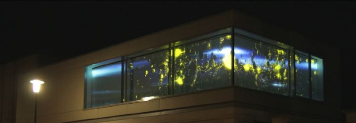
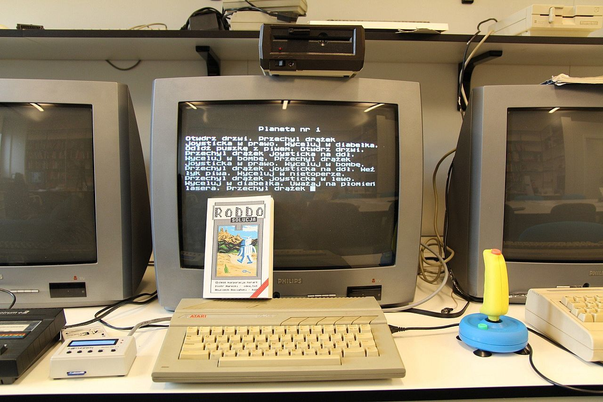

# “野生”演示
今天是演示场景概论的第六节课，“野生”演示（wild demo）。野生演示是怎么一回事，又有怎样的发展历史呢？在2002年芬兰Assembly Party的《野生演示入门》（Wild demo primer）里面的一句话简单地概括了“野生”演示出现的目的：

> The original purpose of the wild compo was to provide a category for entries done on platforms not accepted in the normal compos.
> 野生作品的最初目的是为在正常作品中不接受的平台上完成的作品提供一个类别。

野生演示显然与一般情况下Demo比赛所具有的细致分类和详尽规则有着明显的不同。典型的demo compo通常有着细致的电脑平台规格分类，比如说像Commodore 64一个类别，PC一个类别，Amiga一个类别等等。但是总会有许多的电脑型号是主办方无法提供的，有一些情况是机型本身比较小众或开发者很少，比如TI-99系列；也有一些机型是有着明显的地域特点而跨国参赛的，比如说国产的学习机和电子词典。这些机型往往就找不到合适的类别参加，因为机器性能和开发工具的差异，为它们开发的演示程序很难和Commodore 64、ZX Spectrum直接进行横向的比较。

但是对硬件平台的好奇心本身确是演示场景的核心价值观之一，爱好者们往往期待能够看到一些奇怪的硬件设备，也因此一个新的类别出现了，用以容纳这些无法被放进特定比赛分类的作品，这就是“野生”演示。

## “野生”的范围是可变的
“野生”演示接纳的作品范围是非常模糊的，通常任何在聚会中找不到合适分类参加的作品都可以作为野生作品参赛，决定是否“野生”的最主要标准，就是在它所希望参与的聚会中是否能找到相应的类别参赛。举例而言，有些比赛接受游戏机作为参赛平台，而有些则不接受，在接受游戏机参赛的聚会中，针对游戏机制作的演示程序可以参加对应类别的比赛，通常是以老式电脑或者是新式电脑的类别参赛，但在不接受游戏机参赛的聚会中，它们就只能参加野生类别的比赛。

例如，芬兰的Assembly Party就将Playstation 2/3，Xbox，Sega Dreamcast等游戏机列入“桌面级”平台，而允许这些平台上的作品参加64KB Intro、4K Intro等组别的比赛，同时允许Java编写的作品参赛。但德国的Revision Party就仅在OldSkool比赛中允许游戏机平台，PC平台上既不能包括游戏机，也不允许Java编写的作品参赛。在这种情况下，一些在Assembly Party上可以被列入相应组别参赛的作品，在Revision Party上就需要参加“野生”类别的比赛。

另外一种情况是有些设备很难被界定为“老式”或“新式”，比如说树莓派相比典型的OldSkool电脑来说性能强很多：它很典型的32位系统，内存往往有512MB或者更大；但相比典型的新式电脑来说它又特别弱。但树莓派的硬件却是目前最为流行的开发板之一，甚至目前销量已经超过单款电脑销售记录的保持着Commodore 64，因此在树莓派平台上的创作并不少，这时树莓派或类似的在开发板上的作品同样面临着分类的问题。在卡内基梅隆大学的Demosplash聚会上，专门提到Arduino是可以作为“现代平台”（Modern）组别参赛，因此树莓派也可以类比这一规则参加，但更多的聚会上，使用开发板创建的作品会被归类于“野生”类别。

## “野生”的起点：场景中的影像作品
如果我们追溯演示场景中“野生”分类的起源，大多数参与者会认为最早一批wild demo作品是演示场景参与者们制作的非实时渲染的录像和动画作品。

我们在第一节课里曾提到过，演示场景的核心活动是制作被称为“demo”的一系列可执行的电脑程序，这一规则通常将非实时渲染的视频内容排除在外，并成为区别“演示”和更广泛意义上的数码及实验影像作品最明显的边界。

但是这并不意味着演示场景的参与者会拒绝制作非实时生成的作品。计算机生成图像（CGI）在技术上和可执行的实时演示有着许多相似、相通的地方，因此一些非实时生成类的动画、视频作品也会被爱好者们在演示聚会中分发和展示。而其中的一些非实时运行的作品得到了参赛的机会，随着这类作品的增多，聚会的组织者们开始尝试为其增加新的类别。

德国帕德博恩大学（University of Paderborn）的学者Doreen Hartmann曾在2014年发表论文《Demoscene中的动画：从混淆到分类》（Animation in the Demoscene. From Obfuscation to Category）中比较系统地介绍了演示场景里的动画作品，文中提到即使在实时运行的演示程序中，包含一些预渲染的效果作为优化性能的“障眼法”是可以被接受的：

> 了解了这些技术和历史情况，人们可以认为，Demoscene的实时原则排除了动画。但事实并非如此。动画几乎从一开始就是Demoscene的一部分，它以不同的形式出现，正如以前的Demoscene研究已经指出的。例如，早期的Demosceners已经用动画图形欺骗了他们的观众，这些动画图形是在背景中预先计算好的，而其他效果则被显示出来（参见Reunanen 2010, 47 and Leonard 2006），或者用只计算一次然后作为动画播放的效果。特别是在80年代末和90年代初的Amiga 500/OCS上，这种循环结构被普遍使用，而没有被场景的参与者所反对（参见Botz 2011, 293）。

一个被认为是让Wild Demo真正登上历史舞台的作品是The Silents小组1991年在丹麦的The Party聚会上发表的Global Trash 2。虽然它并非在计算机上实时运行的程序，但它展示了许多当时领先的CGI动画效果，因此在演示场景中得到了爱好者们的高度评价，并促使演示场景设立新的“野生”类别来接受这类的作品。在该作品的介绍中这样写道：

> 《Global Trash II》曾在全欧洲的各类计算机会议上展示过，并在MTV欧洲频道上播放过几次。它在91年帮助诞生了一个名为“野生演示”的新场景，今天的野生演示场景包括许多演示团体。Global Trash II是第一个冲进演示场景的视频演示，为演示和视频设定了新的标准。

在1991年《Global Trash II》出现的年代，还没有像Video CD或者DVD等数字化的家用视频分发路径，所以它当时是以VHS录像带的形式在聚会上分发的。

## Demoscene影像作品的特点
如果我们仔细地检查《Global Trash II》中的每个镜头，就会发现它有着许多在同时期的演示程序中常见的效果，比如旋转的3D模型，连续生成的光条、烟雾效果等等。《从混淆到分类》一文里面其实也归纳了一些Demoscene中出现的视频影像类作品的特点。

### 突出视觉效果而非叙事
其中提到Demoscene动画作品中常见的创作手法之一，是使用非编程的模拟式的手段来模仿演示程序的效果，并指出演示场景中的影像作品并不强调视频的叙事性：

> 实验几何、抽象的形式或排版以及这些元素的（有时是虚构的）物理规律似乎是很多Demoscene动画的基本要素。许多Demoscene动画利用经典的演示效果来“赢得观众的心”，例如Gaspode的定格动画作品就可以说明这一点。在他的作品中，他以演示效果为主题，并对其进行模拟重建（见Noodles（2010）或Sugar Shock（2013））。这些作品在场景中非常受欢迎，自然是出于自我认知的原因。相反，Demoscene之外的计算机生成的作品和数字电影作品把重点放在讲故事上。

在文中举例的2010年的作品Noodles中，我们可以看到视频作者使用各式的面条制作定格动画，并在其中模仿了大量实时生成类的演示场景中常见的画面，你会发现它里面其实出现了非常多很有代表性这种Demoscene的风格的画面：旋转的立方体、跳动的小球，以及模仿的电脑程序加载进度条。

### 音画联觉
但文中接下来认为并非只有模仿实时生成图像效果的作品才会被演示场景接受，而演示场景对视频最核心的评价标准，是音频和视觉效果的同步，也就是音画联觉（Synaesthesia）：

> 相反，成功的演示动画的另一个方面似乎在这个案例中起了作用：音频和视觉效果的同步。这也许是最核心的评价标准，这并不奇怪，因为它也是实时演示的一个主要方面。JCO的动画作品《采样美学的视觉方法》（2013）可以作为一个例子。

文中举例的《采样美学的视觉方法》（Visual Approach to the Aesthetics of Sampling）是一个较新的作品，而其中的创作手法，可以直接追溯到2002年的《Techno美学的视觉方法》（Visual Approach To The Aesthetics Of Techno）

### 遵循非商业化的黑客伦理
《从混淆到分类》还提到的演示场景动画中的一个特点则是非商业性：

> 另一个特点是非商业性，动画必须只为该场景而做--因此动画遵循整体的Demoscene "伦理"。这也标志着与其他CGI节（如Ars Electronica动画节）的主要区别，在其他CGI节上，商业作品与业余作品并列投票。

## 实时野生
在“野生”类别在演示场景中出现之后，视频影像类作品一直都是“野生”作品中最重要、作品数量最大的细分类别，但在2000年代初，一些演示聚会的组织者发现视频作品的流行削弱了演示场景以计算机为核心的特点：

> 遗憾的是，最近野生演示已经越来越多地变成了家庭视频演示，其作品与计算机没有任何关系。虽然其中许多作品无疑是相当幽默的，甚至做得相当好，但大量的家庭录像使计算机制作的作品退出了决赛。 《野生演示入门》（Wild demo primer，Assembly Party，2002）

而作为对这种变化的回应，比赛的组织者调整了参赛的规则，赋予计算机生成的作品更高的权重

> ……例如，去年在诺基亚9210通讯器上进行的野外演示，就是一个关于真正野外演示的好例子。
> ……
> 今年，为了使野生演示比赛更接近其最初的目的，计算机生成的作品将在评审过程中获得优势，比赛组织者保留将低质量作品从比赛中剔除的全部权利。 《野生演示入门》（Wild demo primer，Assembly Party，2002）

文中提到的诺基亚9210通讯器上的作品，是Pygmy Projects的作品G-Force 2001。诺基亚9210是原名为EPOC的操作系统改名为Symbian之后的第一款智能手机，也是诺基亚第一款Series 80设备。G-Force 2001遵循其他类别的demo作品的一般特点：以可执行程序的形式发布，并实时地生成图像和声音效果；而与其他demo作品最大的不同则是它运行在另类的平台上：诺基亚9210作为2001年夏天才推出的设备，显然不能被归于Oldskool平台，但它作为一款移动设备，性能又与台式PC有着较大差距，因此这类作品就只能作为“野生”类别参与演示比赛。

而为了将这类编程且实时运行的作品与一般的动画作品区分，这类作品往往被称作“实时野生”（real-time wild）或“真野生”（real wild）演示。

## 与电子DIY文化的结合
2000年代演示场景中对实时野生作品的鼓励带来了演示场景爱好者对设计各种演示装置的热情，并成为演示场景和电子DIY文化重要的交叉点。其中一系列作品继承了实时类别演示作品的一些效果，并利用非典型的计算机硬件和自制装置复现出来。

比如2003的作品LED megademo使用的显示设备就是一个20×4的液晶显示器，它的代码运行在PC硬件和Linux系统上，并模仿了PC demo上一些常见的效果，比如滚动字幕和旋转立方体的动画。但由于利用了不同的显示设备，它创造出与电脑显示器明显不同的视听体验。

而演示场景中还有一种常见的另类显示设备就是示波器，2007年的作品Youscope很可能是第一个在演示场景中展示的示波器作品，它利用了示波器的X-Y模式进行绘图，并使用电脑声卡作为信号源，电脑声卡的左右两个声道分别输出X轴和Y轴的信号实现绘制动画。使用示波器作为显示设备的演示之后在演示场景中又出现过多次，有爱好者专门整理了一个列表收集了一系列类似的作品。

另外一类在野生演示中常见平台是MCU（Micro Controller - 微控制器），也就是单片机。在瑞典音乐家Linus Åkesson（lft）的网站上就整理了一系列单片机相关的作品，而他也是瑞典合成器厂家Teenage Engineering的工程师之一。

其中一个名为《硬件芯片音乐项目》（The Hardware Chiptune Project）的作品发表于2007年，展示了不使用任何已有的声音芯片，而是通过对AVR进行编程，实现类似声音芯片的音乐效果。

而2008年Linus又发表了一个更加复杂的作品《Craft》，利用ATmega88单片机，不仅实现了音乐效果，而且实现了通过VGA接口输出动态图像。

使用单片机制作的野生演示作品还有很多，比如这几年做各种跟WiFi有关的物联网装置常用的ESP8266，就在2017年的Demosplash聚会中出现，使用ESP8266生成电视信号的作品espTV就在当年的“自由影像”类别中拔得头筹。

在2000年代使用LED灯光装置也出现在野生演示比赛中，在挪威举办的Kindergarden 2008聚会中，使用自制LED装置的Hey ho, led's go!获得了野生类别的第二名。由于那场聚会中实时和非实时比赛混合参加“野生”类别的比赛，因此当时的第一名是非实时动画作品。

在2010年代LED灯光装置仍然是野生演示创作的重要内容。Revision 2015中获得第一名的野生演示作品是名PC-10: Panda³的可编程灯光装置，安装在有机玻璃盒子边框中的LED灯光是使用Arduino单片机控制的。

## 综合材料：万物皆可“黑”
进入2010年代之后，wild demo场景在对媒介的使用上更加具有实验性，爱好者们会利用很多特别意想不到的设备进行创作。2010年德国工业音乐团体Haujobb的作品Payback就使用了银行中的自动取款机作为创作的平台。

2013年，德国著名的演示聚会Revision Party开始跟萨尔造型艺术学院 (HBKsaar) 实验媒体实验室（xm:lab）合作，面向演示场景爱好者征集针对媒体幕墙（Media Facade）的作品。

  
*实验媒体实验室xm:lab所安装的媒体幕墙*

类似的装置在2020年之后在国内特别流行，往往被称作“海浪屏”或“裸眼3D大屏”，这主要是由于韩国COEX购物中心外墙上的LED大屏带来的巨大营销效果在国内引发的新媒体公共艺术热潮，而这已经比演示场景的尝试落后了6~7年。

Revision Party的比赛现场使用了5个投影机组成的媒体幕墙。我们可以看出2013年的作品仍然相对粗糙，许多作品的表现形态与多频影像作品无异。但第一名的作品《White water》已经展示出利用媒体幕墙中的拐角制造三维空间幻象的实践。而2016年，相关的作品就已经可以更加成熟地利用幕墙的特性，制造出碰撞、打破玻璃等更有空间感的效果了。

近两年被频繁提起的“太空艺术”也早在2014年就进入演示场景爱好者的实践，作品10 Orbyte将一段10KB的Commodore 64的demo代码放到了名为WREN的微型立方体卫星内置的闪存上，这颗卫星在UniSat-5任务中被发射入轨，并会在轨道上飞行大概20年。

2014年在演示场景中受到关注的另外一个作品则展示了对点阵磁翻显示屏（flip-dot display）的利用，XAYAX小组制作的演示Flippin' The Dots使用了慕尼黑混沌计算机俱乐部（Chaos Computer Club Munich eV）设计的基于树莓派和网络控制的点阵磁翻显示屏，并在不来梅举办的Nordlicht 2014聚会中获得野生演示比赛的第一名。

实物光雕投影（Projection mapping）作品也出现在野生演示的比赛中，2014年Gaspode小组使用Amiga电脑外壳作为显示表面，制作了名为Light & Magic的作品。

可编程的激光表演是2010年代野生演示中新出现的内容，一些爱好者尝试将老式硬件融入到激光表演中，KETTŐ小组制作的LSR 64就是使用Commodore 64控制的激光装置表演。

而2017年在东京Tokyo Demo Fest上发布的激光作品reLase则是开源激光图形框架OpenLase的作者Hector Martin为展示该框架的功能而制作的。

可穿戴设备，比如Pebble Time智能手表也成为爱好者们创作的平台。2016年的作品Rocky Reality就在智能手表的小屏幕上重现了1993年著名的DOS演示Second Reality的图像效果。

而与老式电脑相关的实验文学也出现在野生演示的比赛中，2017年波兰Silly Venture中的参赛作品Robbo Solucja（Robbo. Walkthrough，Robbo攻略）就是由波兰亚盖沃大学（Jagiellonian University）的助理教授Piotr Marecki编写的。这个程序以波兰曾经流行的Atari XL / XE电脑游戏《Robbo》为灵感编写的一部“Robbo攻略生成器”。

  
*运行中的《Robbo Solucja》程序和同名图书*

在2018年，Piotr Marecki将由Robbo Solucja生成的56段游戏攻略编辑成册，并出版了同名图书《Robbo. Solucja》而整本图书的编辑和排版，都是使用Atari ST电脑上的软件完成的，在2019年的论文《雅达利、创意制作和僵尸电脑》（Atari, Creative Making & Zombie Computers）中，就介绍了Robbo. Solucja软件和图书制作的详细情况。

而一些最新型的显示设备也被演示场景中的爱好者所运用，在2021年的Revision聚会中就出现了使用容积显示器Voxon VX-1制作的作品HoloGrail。

通过对过去20年里各类“实时野生”作品的回顾，我们不难发现，演示场景中的“野生演示”与通常意义上的新媒体艺术作品的边界已经非常模糊，而创作者对演示场景文化和价值观的认同，是他们选择通过演示聚会而非新媒体艺术展览发表其作品的主要原因。

## 非电脑的野生演示
在“野生演示”中，还有一些作品既不是视频或动画类的影像作品、也并非由编程或电子制作形成的“实时野生”作品，这一类作品更接近机械装置或行为艺术作品。

比如说我们在《数字媒体实验考古》课程里面有讲过的书写投影器（Overhead Projector OHP）的一些光学特性，就时常被演示场景中的爱好者用来编排光学表演。

在2008年瑞士温特图尔（Winterthur）举办的Buenzli聚会上，cortex小组的作品就获得了野生演示比赛的第一名，作品标题“Interferenz”在德语里的含义是“干涉条纹”，而这正是书写投影器作品最常用的效果之一。后来这一小组也多次以书写投影器作品参加比赛，他们的作品被整理在Pouet.net的数据库里。

2012年美国波士顿举办的@party上，Desire和TRSI小组也展示了他们的书写投影器作品：《OHP MEGA DEMO 9000》，其中出现了不少实时生成演示程序中常见的效果，比如加载进度条、跳动的彩球、波浪状飞过屏幕的字幕等等。

演示场景里完全“不插电”的作品虽然较为少见，但仍然是不可忽视的一个类别。比如Outbreak & Darklite小组的《Pixel by Pixel》，就是一件利用马赛克在浴室墙壁上复现像素艺术的作品。而Danish Underpants Brigade小组的《Demoscene Battle Cards》则将演示场景中的“名人”编写为桌游中的游戏角色，展示出科技艺术社群比较搞笑和脑洞的一面。

对于演示场景来说，“野生演示”的存在代表着社区的张力和弹性，它让演示场景从一个纯计算机技术社群的基础上向外延伸，在连接不同爱好者社群的同时向其他社群分享其创意与文化，其边界之广，已经可以触及到一系列计算机之外的创作。