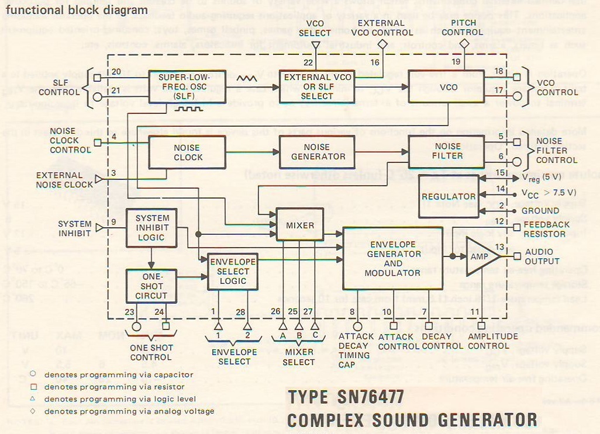

# 声音芯片和芯片音乐
这节课是演示场景概论第七节课，它也是“芯片音乐”（Chip music/Chiptune）这一单元的第一节课。在演示场景的要介绍芯片音乐的一个重要原因是它是演示场景与大众文化一个非常重要交叉点。

## 与大众文化的交叉点
演示场景在很多不同领域都曾与大众文化产生过交互的影响，但芯片音乐是其中最容易观察，也是资料较为丰富的一个领域。通过芯片音乐我们至少可以从两个维度来看到演示场景与大众文化之间的相互联系：一方面是芯片音乐和电子游戏联系密切，从电子游戏音乐的发展中受益，同时也回馈一些创意给电子游戏领域；另外一个方面是它跟流行音乐之间的联系和启发。

一个具有代表性的例子是Zombie Nation（僵尸国度乐队）的Kernkraft 400，在电音节和体育场里面都能常常能听到它代表性的旋律。在2018年VICE制作的短片《体育场里最热门的歌曲的故事：僵尸国度的“Kernkraft 400”》（The Story of the Biggest Sports Stadium Hit: "Kernkraft 400" by Zombie Nation）中，就透露出了这首在几乎所有电音节和诸多体育比赛里都能够听到的旋律与芯片音乐场景的联系，它的制作受到了Commodore 64游戏音乐的启发，在录制的过程中也利用了典型的芯片音乐设备SID Station。

如果说僵尸国度的例子展示出来的更多是游戏音乐、芯片音乐对流行音乐场域的影响。而一个反向的例子，则是电子音乐先锋，比如让·米歇尔·雅尔对Commodore 64音乐人的启发。

2015年的时候，C64Audio.com启动了Project Sidologie，邀请曾经为Commodore 64作曲家以让·米歇尔·雅尔的风格重新编写Commodore 64音乐来纪念雅尔对他们的启发。其中特别提到了Ben Daglish在Commodore 64游戏Loco中对《春分秋分5》（Equinoxe 5）的改编。

同样参加Project Sidologie的另一位Commodore 64音乐家Rob Hubbard的影响力则从流行音乐扩展到了交响乐，并让其为游戏编写的音乐在严肃的古典音乐场合演出。这一过程中包含了许多参与者的努力，比如说C64Audio.com网站的建立者，同时也是Project Sidologie的发起人Chris Abbott。从90年代末至今，C64Audio.com发行了超过30张Commodore 64音乐的重混音专辑。而8-Bit Symphony则是C64Audio.com与Rob Hubbard在2019年一同启动的新项目，通过这一项目，他们成功地将游戏音乐改编成交响乐版本演出。

因此当我们谈到Demoscene时候，芯片音乐是一个了解Demoscene是如何与外界来沟通非常好的主题，接下来的三节课都会围绕这个主题展开。

## 声音芯片
让老式电子游戏机发出声音的秘密在于声音芯片（Sound Chip），那么声音芯片究竟是什么原理？我找到一款特别老的电子游戏机芯片，也是最早的声音芯片之一，德州仪器SN76477“复杂声音生成器”（Complex Sound Generation）看看它里面都有哪些主要的部件：

- Super LFO，“超级低频震荡器”，它比一般的低频震荡器提供更灵活的音调和振幅调节
- VCO，压控震荡器
- Noise Generator噪音发声器
- Envelope Generator and Modulator，即包络发生器和调制器

  
*SN76477功能框图*

如果你之前见过一些合成器，比如像Moog、雅马哈DX7、罗兰JUNO，或者任何它们的简化版，比如我之前用过的罗兰JUNO的简化版JX-3P。你会发现这些功能在许多合成器上都可以找到。其实声音芯片就是一台小合成器，它把合成器的典型功能集成到单个芯片里面。

与市售的商品合成器有许多不同型号一样，声音芯片也有许多功能、特点各不相同的型号。不同声音芯片就像不同乐器一样有着不同的音响特点和演奏技巧，这跟大众话语里往往将不同类型的芯片笼统地称作“芯片音乐”的理解有着明显不同，在《剑桥电子游戏音乐指南》（The Cambridge Companion to Video Game Music）中《红皮书之前：早期视频游戏音乐和技术》（Before Red Book: early video game music and technology）一文中，就指出了大众语境中的这种混肴：

> 从历史学家的角度来看，“芯片音乐”这个词有一种无益的扁平化效应。很简单，电子游戏音乐有各种各样的“芯片”，现在、过去和将来都可以使用，这样的称呼只有助于将其与磁盘或在线流媒体的音乐区分开来。“芯片音乐”没有告诉我们Commodore 64、NES或太空入侵者街机之间的差异，也没有告诉我们作曲家和声音设计师如何研究、利用和扩展其潜力。
> 鉴于目前对早期视频游戏音乐的描述倾向于使用“哔哔声”和“哔哩声”的语言，这种扁平化的效果尤其令人困扰……

不同声音芯片之间的区别从它们的技术规格就可以体现出来，下面我列举一些常见的声音芯片，大家可以观察其技术规格。同时也会提供一些声音演奏的样本，可以直观地体验其音色的不同

### Atari TIA
Atari TIA差不多是我们在今天仍然能频繁听到其音效的声音芯片中最旧的芯片，它被用在游戏史上无法绕过的一款游戏机雅达利VCS，也就是雅达利2600上。它的增强版本雅达利7800也同样使用了这款芯片。

在TIA(Television Interface Adapter)芯片里使用了5个比特来表示音高，因此有2的5次方即32个音阶。Atari TIA芯片的音阶并不是以我们常用的七声音阶或者是以12平均律来提供的，而是以频率对数倍数来排列的，由于音阶排列的原因，Atari TIA的32个音阶其中有许多很难被利用。即使相比有以十二平均律排列的44个按键的玩具电子琴，Atari TIA可使用的音阶很有限，也较难被用作演奏乐曲。

Atari TIA支持16种音色16级振幅，并且有两个声音通道，即可以同时发出两种声音。虽然Atari TIA为音乐创作者提供的空间很有限，但仍然有芯片音乐家用它来做演现场演奏，比如说澳大利亚芯片音乐家cTrix的一个重要作品就是gAtari，它结合了Atari VCS游戏机和效果器，并可以像吉他那样怀抱着演奏。上面的视频来自于2011年东京Blip Festival芯片音乐聚会。

许多时候国内的媒体往往将芯片音乐望文生义地描述为“采样精度为8比特”的音乐，这是一个很误导人的说法，因为数字音频技术中“8-bit采样精度”指的是记录振幅的精度，按这一标准来说，Atari TIA对振幅的记录只有16级，也就是4-bit，所以按这个标准来说包括NES、Commodore 64在内的大多数设备似乎都该被描述为“4-bit音乐”这显然是不合常理的。

### Atari POKEY
另外一款比较重要的声音芯片是Atari POKEY，这款芯片是为最早的游戏PC，1979年底推出的Atari 8-bit系列专门开发的，和ANTIC和CTIA/GTIA芯片一起构建了在当时的家用电脑里最适合游戏的芯片组。除了生成声音之外，POKEY还负责电脑的输入输出功能，它的名字“POKEY”就是电位器和键盘（Potentiometer & Keyboard）的缩写。

相比Atari TIA，POKEY最大的改变是它有256级的音高，更精确的音高控制让POKEY在创作乐曲时更加便利。此外POKEY维持了4-bit的振幅控制精度，但有声音通道从两个增加到四个，因此为POKEY编写的音乐可以有更多的声部。

我们来看一下POKEY效果是什么样子，在Atari 8-bit系列电脑上，许多游戏的标题画面都加入了完整的音乐，但是由于机器性能的限制，具有完整背景音乐的游戏并不多，而更晚一些由爱好者们开发的演示程序则具有音画同步的效果。

在Atari SAP Music Archive中，存档了超过5000首为Atari POKEY芯片编写的音乐：http://asma.atari.org/

### 任天堂NES/FC
接下来要介绍的声音芯片是非常具有代表性、而且大家也都较为熟悉的游戏机声音芯片，这就是任天堂红白机所使用的理光2A03和2A07芯片。理光的这两款芯片并非单独的声音芯片，而是集成有声音芯片的CPU，它们所集成的声音芯片功能，有些时候也被描述为声音处理单元（audio processing unit，APU）。

红白机APU功能丰富，有五个声音通道，是同时期常见的声音芯片中最多的，得益于这一点，大部分红白机游戏都带有背景音乐。它的振幅控制跟POKEY相似，都提供16级振幅，但音高控制更加精细，红白机有11-bit音高控制，能够产生2048种不同的音高。

红白机APU提供几种不同类型的声音通道，有两个方波（脉冲）通道、一个三角波通道、一个噪音通道和一个7比特PCM采样通道。其中方波通道可以通过编程调节工作周期（duty cycle），提供12.5%、25%、50%、75%四级工作周期的调节，因此可以合成出更加丰富的音色。

红白机上的游戏音乐非常丰富，很多都为国内爱好者所熟悉，比如《忍者龙剑传》、《洛克人》、《魂斗罗》、《恶魔城》等等。

### Commodore 64/SID
另一个非常重要的音乐设备是Commodore 64，它和任天堂NES是目前芯片音乐场景里最有代表性两种设备，无论是在爱好者还是音乐人中都有着很高的人气。Commodore 64内置的声音芯片叫做SID（ Sound Interface Device），它有两个版本，最初的版本叫做6581，和80年代中期推出的修订版8580。

这两款芯片的特性略有不同，8580芯片的失真更小，也更精确地符合规格说明书里的特性，6581则有一些不符合设计规格的瑕疵，许多时候音乐制作者会利用6581的瑕疵，特别是滤波器的失真去构建想要的声音效果。有些时候，音乐人会特别标记他们的作品是使用6581还是8580版本的SID芯片制作的。

SID的设计团队在离开MOS Technology之后成立了Ensoniq，在1998年被声卡巨头创新收购之前，Ensoniq是80年代和90年代间是重要的合成器和声卡制造商。

SID跟Atari POKEY和红白机APU相似，也提供4-bit精度振幅控制，但它提供了比同时期其他芯片更精细的音高控制，SID使用16比特来控制音高，这让它的音高达到65536级。

SID芯片提供了3个通道，它的通道数没有红白机APU多，但提供了额外的灵活性。SID芯片的三个通道都可以在锯齿波、三角波、脉冲和噪音4种功能之间灵活切换，这为SID音乐创作者们提供了更高的自由度，也让Commodore 64上的作品类型空前丰富。无论是游戏还是演示程序的作者们，都为SID芯片创作了大量音乐作品。在High Voltage SID Collection中，收集了超过55,000个SID音乐作品

### General Instrument AY-3-8910

无论是搭载红白机APU的理光2A03/2A07，还是Commodore SID芯片，它们都有一个重要的限制就是和特定硬件紧密绑定，这两种芯片分别都只能在红白机和Commodore 64家用电脑中找到。接下来我要提到两款芯片，可以说是两款通用的芯片音乐解决方案，分别是通用仪器（General Instrument）AY-3-8910和德州仪器SN76489。它们都可以在许多不同类型的设备上见到。

通用仪器AY-3-8910及其克隆芯片是使用最广泛的声音芯片之一，出现在大量不同的电脑设备上，Amstrad CPC，MSX、Atari ST、ZX Spectrum 128、Intellivision，Fujitsu FM-7、Sharp X1等一系列家用电脑都使用了AY3或它的仿制品，雅马哈也授权生产了AY-3-8910的一个小改版YM2149F，并在AY芯片PSG（可编程声音发生器Programmable Sound Generator）功能的基础上，开发出了在一系列NEC PC-8801和PC-9801机型上所使用的，既有FM合成功能也有PSG功能的OPN（YM2203）系列芯片。

AY-3-8910有3个通道。可以产生脉冲、噪音或三角波，不过它的脉冲功能不像红白机APU那样有可调节的工作周期（Duty Cycle）。它也提供16级（4-bit）的振幅选择，以及4096（12-bit）级的音高选择。

AY-3-8910芯片虽然功能上不如SID和红白机APU强大，但它最大的优势在于非常容易买到，街机厅里常见的“水果机”的主板上往往就有AY系列芯片的兼容型，比较常见的是台湾华邦（Winbond）生产的WF19054芯片。

我们往往可以在MSX或ZX Spectrum 128K机型的demo上听到AY-3-8910芯片的声音。

### 德州仪器SN76489

一款跟AY-3-8910类似的被广泛运用在各种电脑设备上的声音芯片是德州仪器SN76489，它是课程开始时提到的SN76477芯片的增强版本。SN76489的功能和AY-3-8910相似，它同样有3个通道和4-bit振幅控制，不过它的音高控制没有AY-3-8910那样精细，只有10-bit，也就是1024种不同的音高。

使用SN76489芯片的设备中最广为人知的是世嘉Genesis游戏机，在国内更多时候用它的日版名字Mega Drive（MD）。世嘉Genesis的声音部分同时使用了SN76489和雅马哈YM2612两颗芯片，前者提供PSG音效，后者提供FM音源。由于Genesis可以同时使用两种音源、而且比较容易买到，所以在芯片音乐爱好者中间颇为流行。

SN76489也被用在许多类型的家用电脑上，德州仪器的TI-99系列是第一款使用SN76489系列芯片的家用电脑。虽然TI-99系列在与Commodore VIC-20和Commodore 64的激烈竞争中表现的并不算成功，但为它开发的图形和声音芯片都被广泛使用在许多不同类型的电脑和游戏机上，除了TI-99系列，SN76489还被用在BBC Micro、ColecoVision、IBM PCjr，Tandy1000以及世嘉Genesis的前身Master System上。

我们来听一下SN76489在BBC Micro上是什么样子：上面这段音乐来自Turrican II（飓风战士II），它的作曲者Chris Hülsbeck也是一款重要的Commodore 64音乐软件SoundMonitor的开发者，这一软件启发了Tracker软件的出现，并间接改变了整个Demoscene和芯片音乐世界的实践。

### AY-3-8910和SN76489的DIY项目

AY-3-8910和SN76489这两款芯片最大的特点是它们有非常非常多DIY项目，围绕着它们的DIY实践从80年代一直延续至今。近几年来比较常见的做法是利用Arduino控制AY或SN76489芯片，通过控制引脚上高低电平将CPU数据发送给声音芯片并控制它发出声音。

一些开发者则尝试把声音芯片跟MIDI键盘连接起来，制作出可以用MIDI键盘控制的声音芯片模块，比如Teensy SN76489就是使用Teensy 2.0开发板配合SN76489制作的小合成器。

这两款芯片相关的开发资源还有许多地方可以找到，比如Arduino提供了一个官方库来驱动SN76489，TB-AY-3则是一个使用MIDI控制AY-3-8910的DIY合成器。相比SID或者红白机APU，AY-3-8910和SN76489更容易买到、数据资料公开、同时开发也较容易，是目前爱好者自制芯片音乐装置和模块的首选。

## 波表合成
可编程声音发生器（PSG）是芯片音乐创作者们最常用的一类声音芯片，但PSG并非是声音芯片唯一的技术路径，另外一种广泛用于声音芯片的技术是波表合成（Wavetable synthesis），波表合成芯片可以将使用者定义的波形存储在芯片内的存储空间里，并周期性的回放对应的波形。

为老式电脑设计的波表合成芯片的存储空间通常很小，一个典型的例子是Konami SCC，它的波表存储空间就只有32个字节，Konami SCC它被用在许多MSX电脑的游戏卡带上，因此SCC的许多技术参数跟MSX上的AY-3-8910 PSG保持一致，比如说16级（4-bit）振幅和4096级（12-bit）音高控制。上面这段视频，我们可以听到Konami SCC所发出的音乐。

## FM合成
FM合成芯片也是声音芯片中常见的一类。这一类别最具代表性的是雅马哈生产的OP系列，比如说OPL、OPN、OPM还有OPZ等等，OP是Operator缩写，这些芯片的全名通常是FM Operator Type-x这样的形式。

FM声音芯片通常有两个关键参数，一个是Channels（通道），它决定了声音芯片同时能够发出的不同声音的数量，即有多少个复音声部（polyphony voices）。在90年代末到2000年代，在通讯领域一个常见的术语是“n和弦铃声”（n-polyphonic ringtones），此处的“和弦”便是指复音声部而非音乐上的“和弦”（chord）。

雅马哈开发了诸多不同型号的FM合成芯片，以提供不同数量的Channel和Operator配比。Channel的数量决定了芯片的复音声部数量，而Operator的数量则决定了合成音色的复杂度和灵活性。

最常见的雅马哈FM合成芯片是OPL2，它是PC上著名的Adlib声卡所使用的芯片，有9个Channels和2个Operators，我之前在《数字媒体实践考古》课展示过的OPL2LPT，就使用了这款芯片。

在一些NEC PC-8801和PC-9801电脑上可以找到OPN（YM2203）芯片，它有3个Channels和4个Operators；OPN2（YM2612）则是世嘉Genesis游戏机使用的FM声音芯片，它有6个Channels和4个Operators；OPM（YM2151）芯片被用于使用摩托罗拉68000处理器的日本家用电脑Sharp X68000上，它有8个Channels和4个Operators。

## 蜂鸣器：没有声音芯片的“芯片音乐”
有一类音乐并没有用到声音芯片，但仍然时常被放在芯片音乐话题下讨论，就是PC蜂鸣器。包括ZX Spectrum、Apple II、以及没有声卡的IBM PC等一系列电脑并没有标配声音芯片，但却具备可以编程控制的蜂鸣器用以输出声音。

这些电脑上蜂鸣器的功能完全取决于CPU性能，在CPU性能比较弱的机型上，往往只能控制蜂鸣器发出简单的滴答声，具有代表性的是早期的PC音乐编辑程序EA Music Construction Set在蜂鸣器上的播放效果。

但当使用Intel 486或更快的CPU时，就可以利用蜂鸣器播放数字音频；如果是Pentium或者更高级的CPU，蜂鸣器还可以回放采样率较高的数字音频，甚至能用来听MP3。

90年代的PC demo利用高性能CPU进行混音，还可以在PC蜂鸣器上播放为Amiga电脑制作的4通道音频。Amiga电脑支持PCM数字音频的采样和回放，而且恰好是8-bit采样深度。但是你会发现数字音频“8-bit”的声音其实是非常不“芯片”的。

在90年代，由于CPU性能强大到可以利用PC蜂鸣器播放音频，同时PC声卡仍然较贵，因此出现了一系列Windows驱动可以利用PC蜂鸣器作为Windows的音频输出设备，这算是PC音频发展过程中的一段小小的岔路。

总而言之，使用蜂鸣器的作品数量不多，很多时候也会由于没有使用声音芯片而被排除在若干关于芯片音乐的讨论之外，但当讨论游戏和Demo音乐时，对于那些默认没有配置声音芯片的平台，比如Apple II和ZX Spectrum，蜂鸣器仍是时常被提起的话题。

## 芯片音乐是如何编写的？
对于80年代的游戏开发者来说，编写芯片音乐往往需要对硬件足够熟悉并且具有较强的编程技能，论文《红皮书之前：早期视频游戏音乐和技术》引用芯片音乐家Rob Hubbard在2002年Assembly聚会上讲座的内容描述了当时的情形：

> 当时没有MIDI音序器，没有跟踪器。我们只用汇编程序来编码一切。我曾经加载一个机器代码监视器来实时显示这些字节。音乐都是由光栅中断触发的，我通过实时修改这些数字来改变合成器的设置和音符。因此，我倾向于以反复修改四个小节的方式工作，我会坐在十六进制编辑器前，改变一些东西，调整一些数字，直到我把这四个小节的声音变成我想要的样子，这样我就可以继续做16个小节...... 《剑桥游戏音乐指南》，第14页

洛克人的音乐作者松前真奈美在US Gamer网站的一次采访里描述了基于Music Macro Language（MML）的工作流程：

> 如今，获得你想创建的数据要简单得多，如果你需要做任何修改，也不是那么困难。那时，为了把音乐数据放进ROM，而你必须把音符转换为数字。我不记得它代表什么，但有一种方法叫 "MML" - "Music (something) Language," 大概 - 然后为了完成这个过程，这是相当困难、相当耗时的。 https://www.usgamer.net/articles/manami-matsumae

MML在日本要远比其他国家更加流行，它不仅作为专业开发者创作游戏音乐的工具，也广泛被爱好者使用。在主流的游戏产品上，直到1998年的Game Basic for Sega Saturn仍然保留了对MML 的支持。

虽然MML编写起来相对较为容易，并且一定程度上可以跨平台。但其可读性仍然较差，并且难以即时检查播放的效果或进行现场演奏，因此今天大多数的芯片音乐人都不再继续使用MML，而是使用Tracker（音轨序列器/跟踪器）来创作。

## Tracker
在今天，Tracker几乎已经成为爱好者制作芯片的事实标准，无论是为PSG编写音乐的工具DefleMask、FamiTracker，还是以采样序列为核心的FastTracker II、OpenMPT，以及已经进入商业DAW市场的Renoise都属于Tracker类的软件。

而最早的Tracker诞生于十多岁的少年之手。1986年，18岁的Chris Hülsbeck在自己为Commodore 64编写的可执行音乐程序《Shades》的基础上开发了名为SoundMonitor 1.0的音乐制作软件，并以十六进制代码列表的形式发表在德国Commodore 64爱好者杂志《64er》上面。

免费分发的SoundMonitor在爱好者社群里面产生了相当广泛的影响。从名字就可以看出，它是之前Rob Hubbard所描述的基于代码监视器（code monitor）的制作流程的优化版：SoundMonitor仍然基于16进制数字表示的音乐数据进行创作，但其操作逻辑较为方便，操作声音芯片的数据以时间轴顺序垂直排列，可以通过键盘移动光标的方式直接修改相应的数字，同时可以随时播放并监听修改的结果。这种时间轴顺序展示、即时修改和监听的逻辑相比之前以修改代码为核心编写音乐的流程简化了许多。

SoundMonitor的流行也受益于演示场景的传播，The Dutch USA-Team开发了SoundMonitor的修改版本Rock Monitor，其传播范围要比原版SoundMonitor还要广。

SoundMonitor以纵向时间轴为核心的编辑方式被认为直接影响了被认为是第一款“真正的”（基于采样的）Tracker软件Ultimate Soundtracker的设计，在《Soundtracker的起源，第一部分：卡Karsten Obarski到底在哪里？》（Soundtracker origins, part 1: Where in the World is Karsten Obarski?）一文中引述了多篇论文来证明Ultimate Soundtracker与SoundMonitor之间的联系。

Tracker类音乐制作软件更高效的创作流程让“地下”芯片音乐场景获得了重要的发展机遇。在Tracker出现之前，芯片音乐的制作门槛很高，通常只有被游戏公司雇佣的专业开发者和有着熟练编程技能的爱好者才能制作芯片音乐，但在Tracker出现之后，编程技能较弱、但是熟悉音乐制作的作曲家、制作人和爱好者也加入到制作芯片音乐的群体中，这种变化是芯片音乐从一种游戏开发的职业技能转化为新的音乐场景的基础。

## 当代芯片音乐的制作
今天芯片音乐场景里大多数的活动是基于Tracker软件展开的，一些Tracker软件设计为在目标设备上运行，并直接驱动老式电脑或游戏机中的声音芯片发声，比如今天被广泛用在现场演出上的Gameboy软件LSDJ和Commodore 64软件defMON。

LSDJ是运行在Gameboy上面的软件，由于受到老式游戏机按钮数量的限制，它在进行复杂编辑时并不像PC那样方便，但却更适合进行现场演出，演出者可以现场控制事先制作的乐曲片段的播放速度，或前进后退等一系列操作，实现类似DJ的演出效果。

另外一类软件就是类似DefleMask这样运行在PC上的制作工具，它可以将乐曲编译成目标平台可以执行的格式，并通过磁带、软盘或烧录卡加载到特定的设备上运行。其中一类在国内较为容易买到的可以用来配合DefleMask制作的设备是世嘉Genesis（MegaDrive）兼容机。无论是游戏机还是烧录卡价格都较为便宜，但许多仿制MD的音质都不太理想，因此购买的时候要小心选择。

一些实践则会通过MIDI接口来控制相应的设备产生音乐，比如2011年在Kickstarter上众筹成功的Chip Maestro就是一款带有MIDI接口的NES卡带，它可以将任天堂红白机变成一台具有MIDI接口的合成器。除了Chip Maestro这样商品化的游戏外设之外，提供MIDI接口的爱好者自行设计的DIY设备也会被用在芯片音乐的制作和表演中。

一些商业化的合成器产品使用了单独的声音芯片，因此可以在脱离老式电脑、游戏机的情况下制作芯片音乐。其中一个在流行音乐界颇受欢迎的设备是Elektron SidStation，它使用了Commodore 64的SID芯片，并被Depeche Mode、Daft Punk、The Prodigy等芯片音乐场景之外的音乐团体用在其作品中。

除了SidStation，SID芯片也被用在Eurorack模块上，比如ALM Busy Circuits生产的SID GUTS系列。

大多数情况下人们讨论芯片音乐时，都是指依靠真实的声音芯片来制作的音乐，但是往往也会遇到一些“假芯片”（fake chip）或“假比特”（fake bit）作品，这类作品的典型实践是使用现代的数字音频软件生成较为简单的方波、三角波、锯齿波等波形来模仿声音芯片的效果。或者使用一些包含有声音芯片音色的音色库。

相比使用真正的声音芯片去制作，“假芯片”不会受到典型的声音芯片对通道数量和波形类别的限制，但也失去了芯片本身所带有的失真效果。在芯片音乐场景里面，“假芯片”是一件颇具争议的事情，英国牛津大学的学者Marilou Polymeropoulou在2014年发表的论文《芯片音乐、“假芯片”和芯片场景中的真实性话语》（Chipmusic, Fakebit and the Discourse of Authenticity in the Chipscene）中就从民族志（ethnographic）的角度讨论了芯片音乐中“假芯片”的地位，作者在开头就提到：

> ……在我们富有成效的讨论中，我有种冲动想问一个话题，在我的印象中，关于芯片音乐的真实性几乎是一个禁忌。Fakebit。他的回答立刻变得失去热情，正如组织者告诉我的，这是他决定退出“场景”的主要原因之一[2]。正如他所解释的，他觉得自从21世纪初芯片音乐的普及以来，芯片场景处于一个不断衰落的过程。因此，芯片音乐已经成为商业化的复古声音元素的杂烩和电子游戏的怀旧情结。他强调，对这种意识形态的衰退负有责任的是那些希望吸引更广泛的、不知情的观众的芯片音乐人。正如组织者总结的那样，没有实际的硬件就不可能将芯片音乐概念化；这就像在没有任何民间乐器的情况下表演民间音乐。

同时这篇论文也提到芯片音乐场景的形成与演示场景之间的联系：

> 第一代被认为是相当纯粹的（Pasdzierny 2012, 179），因为它与Demoscene直接相关（Tomczak 2011; Carlsson 2008, 162; Pasdzierny 2012; Nova 2014）。

而下一节课内容，我就更加聚焦地介绍Demoscene在芯片音乐脱离游戏工业并成为一种独立的音乐亚文化过程中的作用。

## 与游戏行业的疏离
虽然在流行文化中，芯片音乐往往被混淆为电子游戏音乐，但芯片音乐场景里许多核心参与者，特别是音乐家和活动的组织者，都在努力地将芯片音乐与游戏音乐撇清关系，中国大陆最有影响力的芯片音乐家孙大威（Sulumi），曾经在纪录片《触电中国》的第二集里说到：“我做的音乐不是给小孩听的，也不是给游戏做背景音乐的，（是）成熟的Club的跳舞音乐”。

类似的说法在芯片音乐场景中并不少见，2018年温哥华芯片音乐协会（Vancouver chipmusic society）举办的ChipLabs #001讲座的幻灯片中，同样出现了

> 它（芯片音乐）不是：“电子游戏音乐”/“游戏音乐混音”/ “电子游戏的任何事情”

很大程度上，芯片音乐场景对游戏行业的距离感，是由于专业的游戏音乐家从未广泛参与芯片音乐社群的建设：

> 我不会说专业的游戏音乐家形成了任何一种“场景”……尽管许多早期的专业人士，如Jeroen Tel和Reyn Ouwehand已经是Demoscene的成员，但这并不是一种常态。（la_mettrie） https://www.pouet.net/topic.php?which=12286&page=1

而让游戏音乐家离开芯片音乐的一个重要的转折点，是在90年代初使用CD的游戏设备的大量出现。在这是时期出现的使用CD的游戏设备包括世嘉Genesis / MegaDrive的Sega CD外设，以及PlayStation、3DO、Amiga CD32等等，除了任天堂是最后一个迁移到光盘介质的厂商，其他的家用游戏机基本都运用了CD作为存储介质，同时游戏行业开始广泛使用CD数字音轨来存储电子游戏的背景音乐（即《红皮书之前：早期视频游戏音乐和技术》所提及的“红皮书”）。

在纪录片《Diggin' in the Carts》的最后一集中，以《铁拳》和《合金装备》为例介绍了CD对电子游戏的影响，而这一集的标题《时代的结束》（The End Of An Era）背后也是指电子游戏音乐受到机器性能限制而大量使用声音芯片的时代的结束。

由于CD数字音轨的引入，电子游戏音乐开始普遍采用影视配乐的制作手段，而声音芯片也被主流的游戏软件开发者弃用。很显然游戏开发商及受雇于他们的音乐家没有动力为一种已经在工业界被淘汰的技术建立某种“场景”。在游戏行业停止使用声音芯片之后的20余年里，以演示场景为代表的“地下社群”一直是芯片音乐得已存续的决定性力量，这也是许多芯片音乐的核心参与者不同意将芯片音乐视为电子游戏衍生品的主要原因。这个系列的下一节课，会给大家详细讲一下芯片音乐走入地下，并在演示场景中得到长足发展的故事。
