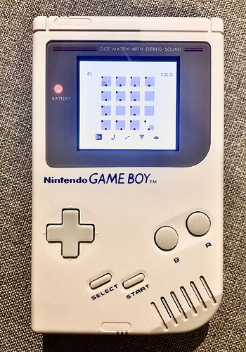
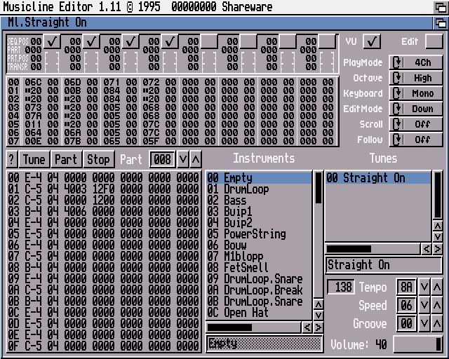
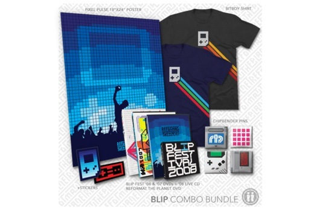
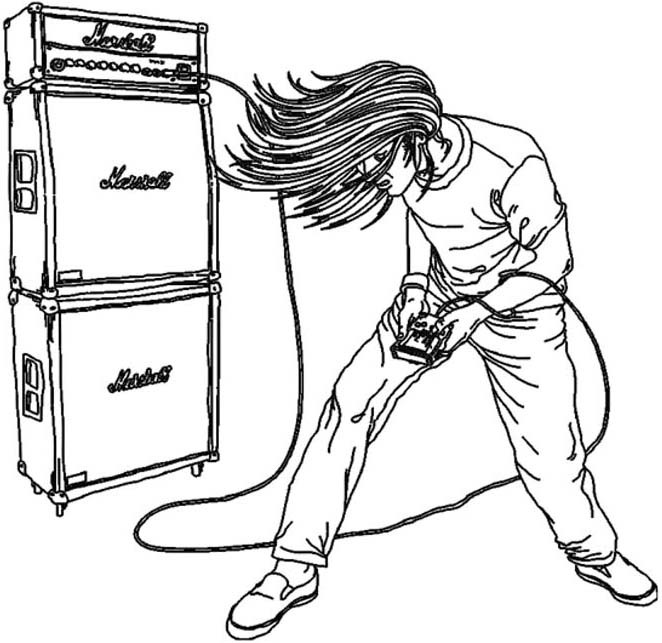
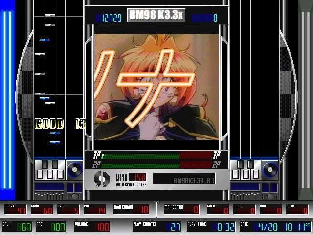

# “新生代”芯片音乐场景
大家好，今天是《演示场景概论》系列课程的第九课，也是“芯片音乐”这一主题的最后一节课。在“芯片音乐”的前面两节课里，我们回顾了芯片音乐8-bit游戏音乐的起源和Demoscene对它的发展，而今天这节课，将聚焦于芯片音乐在游戏和演示场景之外的部分——特别是从90年代中后期起以LSDJ和Nanoloop为代表的，来自Demoscene之外的芯片音乐制作工具带来的既非游戏音乐、也游离于Demoscene之外的芯片音乐社群。

## 芯片音乐并不总是遵循演示场景中的可执行原则
在主流的Demoscene实践中，当演示程序在发布之后，它们的视听效果就已经是确定的，演示程序通常对运行它们的计算机平台有着明确的要求，程序作者们需要保证演示比赛组织者能够在现场运行它们制作的程序，并以预期的效果向现场的观众们展示，而任何意外和变数都可能导致比赛中的失利：程序可能无法在比赛现场正常运行，或无法达到最佳的运行要求。

但对于芯片音乐作者来说，虽然他们也会制作可执行的音乐程序（Executable Music），并基本遵循其他类别的演示场景比赛的共同规则，比如对运行平台、播放时间、程序容量进行限制。但他们的作品还有另外一个面向观众的场合，即现场表演。在芯片音乐场景中，一些音乐人的口碑完全建立在现场表演之上而没有制作可执行音乐程序的经验。

论文2013年的论文集《音乐与游戏》（Music and Game: Perspectives on a Popular Alliance）收录了柏林艺术大学Matthias Pasdzierny的论文《舞台上的极客：（现场表演）芯片音乐世界的调查》（Geeks on Stage? Investigations in the World of (Live) Chipmusic）中较为详细地介绍了作为现场表演的芯片音乐的产生和发展。

在这篇论文里，作者指出今天“芯片音乐”的定义存在很大模糊的空间，特别是声音芯片的应用领域并不仅限于家用电脑和游戏机，而包括玩具、电话、乐器等等。

> 但是，正如Carlsson自己提到的，这样的分类隐藏着新的问题，特别是在进一步的分离，例如，因为声音芯片已经被组装在不仅是游戏机和家用电脑，而且还在玩具，电话，乐器（如不同种类的电子键盘）和其他各种设备（同上）。

也因此他将讨论聚焦于“场景”而非“芯片”，并指出Demoscene和以Tracker为代表的“开源”音乐制作和交流是芯片音乐场景形成的关键：MOD文件保存了音乐制作者所使用的所有采样和组织、编排它们的结构，并允许所有人修改和重用它们。

> 跟踪器之所以对Demoscene有如此大的吸引力，是因为它可以以开放源码的形式分享音乐。在作曲或编曲过程结束时，没有必要将音乐导出为——在某种程度上是封闭的——声音文件（通常包括声音质量的损失），但音乐以模块文件（所谓的MOD）的形式存在（并被传播），其中包含所有使用的样本和模式信息，并在各个方面保持对所有人的可编辑性。

## 认真对待硬件的第一代芯片音乐人
海外的研究者们基本都承认芯片音乐的“场景”形成于Demoscene，并成为芯片音乐场景的“第一代”成员。同时他们也指出，从90年代中后期开始，新加入的芯片音乐制作者往往不再与Demoscene联系密切，而此时的芯片音乐场景逐渐从演示场景中分离出来，成为有自己的活动、术语和文化符号的新场景。

这些新加入的演示场景成员被称作“第二代”和“第三代”芯片音乐制作者。在《舞台上的极客：（现场表演）芯片音乐世界的调查》中，用“第二代”或“新派”来形容2000年前后芯片音乐场景新出现的，较重视表演、轻视技术的派别；而《芯片音乐、Fakebit和芯片场景中的真实性话语》（Chipmusic, Fakebit and the Discourse of Authenticity in the Chipscene）则加入了对文化上更加反叛，更无视硬件特性的“第三代”芯片音乐人的描述。

《舞台上的极客：（现场表演）芯片音乐世界的调查》确认了我们在这节课开始时提到的一个观点，即在芯片音乐诞生的时期，因此诞生于演示场景的芯片音乐最初是遵循演示程序编程、执行的展示流程，而没有现场表演的。

> 首先，我们必须注意到，在芯片音乐场景的初期，传统的现场表演并不重要，或者说， 事实上并不存在。相反，编程本身被认为是一种表演，特别是如果像在演示现场一样， 每个人都带着自己的计算机系统参加演示会，并公开打磨他或她的演示到最后一秒。
> ……
> 在这方面，chiptuners认真对待计算机的独立生活，或者说，正如Daniel Botz所写的， 遵循Friedrich Kittler的理论："[演示]不是基于遵循理想形式并通过适当的计算机技术实 现的塑造目的。它们在生产和复制方面与特定硬件的可能性和局限性紧密相连。[......]想 法不是第一位的，而是机器"。(同上: 29)

早期芯片音乐人对待硬件的认真继承自Demoscene，这足以解释许多芯片音乐人对特定硬件的“忠诚”，他们愿意花更多的时间和金钱去收集和修复旧型硬件及声音芯片，而在相当程度上拒绝模拟器。同样的理由也支撑了老式电脑演示（oldskool demo）和复古计算社群的经久不衰。

## 第二代芯片音乐人：接受流行音乐的惯例
《舞台上的极客》中提到的“第二代”或“新派”（new school）芯片音乐人可能更接近我们今天对芯片音乐的印象，至少他们使用的许多软件都是我们今天在提及芯片音乐时出现频率最高的，比如LSDJ和FamiTracker等等。而他们与演示场景之间无论是社群文化还是实践特点之间都产生了诸多不同。

> 与Demoscene不同，所谓的“第二代”或“新派”的芯片音乐家（Dittbrenner 2007: 116, Yabsley 2007: 15），是从2000年左右开始的，他们对流行音乐的惯例和社区更加开放。新的Tracker程序，首先是用于Game Boy的LSDj，以及NES/Famicom追踪器，如MCK/MCKC和 FamiTracker相继出现，使人们有可能专注于摆弄声音和将计算机系统用作现场表演乐器的可能性，而不仅是其技术背景——这就是为什么Demoscene的部分参与者创造了 “Cubase芯片音乐 家”的冷笑话的原因（Carlsson 2007: 156）。自从这个以表演为导向的场景出现，术语也发生了变化。例如“芯片音乐”这个概念的定义已经扩大了。“理想情况下，它应该是带有方波的跳舞音乐。我想说这是新千年（立体声）类型的芯片音乐。而纯粹主义者们则难免嘀咕……”（Carlsson 2010: 5）有时术语“fakebit”（而不是8-bit）会出现在这种情况下，定义为使用 1980年代芯片音乐的声音，但完全由普通现代采样器、合成器和音序器程序制作的音乐。

从80年代到90年代，芯片音乐从Demoscene中发展出一系列软件、工具和方法。但90年代末到2000年前后的芯片音乐最重要的标志是从Demoscene中“出走”而更多结合流行音乐的特点，这一时期芯片音乐场景对声音的关注超越了硬件，而这种尝试的一个极端就是“只要声音而不要硬件”，正如“Cubase芯片音乐家”的名字所描述的那样，“假芯片”音乐人大量使用数字音频工作站（DAW）软件进行制作，而不一定使用真正的声音芯片，也通常不会了解声音芯片的可编程特性。

在第二代芯片音乐人之中出现的“假芯片”可能是目前芯片音乐世界里最具争议性的话题，这种争议一直持续至今，但在稍后要介绍的“第三代”芯片音乐人中，“假芯片”要比以往代际的参与者都有着更高的接受度。

“Cubase芯片音乐家”被Demoscene成员所批评的核心原因并非仅仅是对硬件或是技术背景态度的不同。他们之间的矛盾实际上是Demoscene所倡导的非商业伦理和数字音频软件所隐喻的与商业制作兼容之间的价值观冲突。

在《老游戏演奏新音乐：芯片音乐亚文化》（Playing new music with old games: The chiptune subculture）中，提及了一句在芯片音乐社群里颇为流行的脏话“Fuck Pro Tools”来解释相当一部分芯片音乐人对数字音频软件的态度。

> 正如我们在上面指出的黑客/朋克的含义中可以看到，chiptune艺术家倾向于将自己表现为固有的颠覆性。从他们声称的反对立场来看，他们无视最新的技术发展、升级、声音和3D图形卡。此外，他们倾向于反对 "计划淘汰 "的想法，这已被证明是通过技术控制和操纵大众的最佳方式之一，特别是在数字时代。他们更喜欢旧电脑和游戏设备，而不是最新的数字音频工作站软件。“Fuck Pro Tools”，正如micromusic在线社区的成员所说的那样。

## Nanoloop
由“第二代”芯片音乐人所发展出来的制作工具中最有影响力的要数Nanoloop和LSDJ了。与前两节课多次提及的，创造并塑造了芯片音乐场景的Tracker不同，Nanoloop和LSDJ并非由Demoscene中的爱好者所开发。他们被认为是以90年代末为起点的一种独立的芯片音乐场景的作品，而它们对平台的选择源于Game Boy在大众市场上的巨大成功。

  
*运行中的Nanoloop*

在德国网络电子音乐杂志《MEMI》的采访中，Nanoloop的作者Oliver Wittchow对自己开发这款软件的起点和动机有着清晰的解释，确认了Nanoloop是作为艺术学院学生的论文项目出现的。同时Oliver在开始创建Nanoloop时并没有编程经验，更不是专业开发者。

但Nanoloop并非是凭空出现的，在1998年Nanoloop出现之前，围绕Game Boy的业余开发者社群已经得到了相当程度的发展，Oliver在采访中明确提到了Game Boy上的BASIC解释器和C编译器基本上在1996年前后就是可用的状态栏。

而在采访中Oliver也提到一系列软件合成器对Nanoloop的启发，其中就包括了JavOICe、Generator（Reaktor）、和Super Collider。

这三款软件基本上覆盖了当时软件合成器开发的各个群体：JavOICe是当时在飞利浦工作的科学家Peter Meijer的研究性项目，其开发的主要目的是为视障人士提供画面音响化的视觉辅助装置；而Generator的起点既是用于音乐创作的软件合成器，并在90年代末利用风险投资转向商业化，SuperCollider最初则是德克萨斯州立大学的学术性项目，旨在开发一种针对音乐合成的编程语言，这个项目在2002年开源并发展至今。

虽然Oliver使用由Demoscene开发的软件，如Fasttracker，但他不认为自己的作品属于“演示场景风格”，他使用FastTracker的理由完全是功能性的：

> 这种风格可以被称为极简浩室（Minimal House），有时也被称为氛围音乐（Ambient）或神游舞曲（Trip Hop）。我非常喜欢极简主义，但我不是一个真正的低保真粉丝。我使用Fasttracker是因为我已经习惯了它，对我来说，它仍然是组织采样最快的方式。这与 "演示场景 "风格无关。它也有一些其他程序不具备的功能，特别是 "采样偏移 "和快速的 "乐器重映射"。

此外Oliver在采访中也排除了与Game Boy的开发商任天堂的关系，包括官方的开发工具或获得卡带授权的机会：

> Thomas Finegan (TF): 你有任天堂的开发工具吗？

> Oliver Wittchow (OW): 没有，Game Boy C编译器是一个非官方的产品，Basic解释器也是如此。互联网上有一个很大的Game Boy粉丝社区。甚至是真正的演示，像当年Amiga或Atari ST上的演示一样。我是在互联网上找到所有关于Game Boy的文件的。

> TF: 你考虑过为Nanoloop获得任天堂的许可吗？

> OW: 我认为它太小、太特别了，任天堂甚至不屑于理会它——即他们对授权不感兴趣，也不打算马上派出律师。
任天堂几乎没有通过Game Boy本身赚取利润，游戏机甚至经常被补贴[注：最近售出了第一亿台Game Boy]，所以我理解授权的事情。这只是这个行业的制度。我也很乐意为Nanoloop获得授权，甚至完全出售它。但我不可能满足成为官方Game Boy开发者的条件，而且几乎不可能直接与任天堂联系，只有可能通过第三方制造商进行。

相比Nanoloop，LSDJ的出现与演示场景有着更加密切的联系，在2012年的采访中，LSDJ的作者Johan Kotlinski提到他的一些朋友是瑞典Hack n' Trade演示小组的成员，他们都同样有着对Commodore 64和Amiga音乐的兴趣，同时他也提到曾经使用过Amiga电脑上的音乐制作工具Musicline Editor，这款运行在Amiga电脑上的音乐制作软件同样也是由Demoscene发展出来的。

  
*Musicline Editor*

在2020年的另一篇采访中，Johan则更具体地描述了当时情形，其中提到的另一位音乐人Goto80，正是Hack n' Trade的成员Anders Carlsson：

> 和瑞典的许多人一样，我在Commodore 64和Amiga中长大，所以很早就习惯了这些声音。90年代初，我学会了Protracker，并在公告板系统上分享了.mod文件，还在FidoNet上结识了与我有相同音乐品味的朋友；主要是当时流行的techno/house/IDM东西。
> ……
> 在90年代中期，我开始使用一个新的Amiga合成音乐程序，名为Musicline Editor。我认为它没有得到普及，因为在这个时候人们都转向了PC和Playstation。不过我很喜欢它。与Protracker相比，它有可能创造新的声音，而不仅仅是使用样本。另外，垂直工作流程使我更容易完成歌曲。我做了很多音乐，玩得很开心，并与我发现的几个有兴趣听的人交换了磁带。
> 2000年，我用我的朋友Goto80制作的Commodore 64音乐印制了7寸黑胶 "木瓜EP"。令人惊讶的是，人们喜欢它，足以卖出一千张。我想这启发了我们俩，使我们在做的事情上投入更多的精力。
> 就在这个时候，我开始为Game Boy Color制作某种音乐程序，结果发现它出奇的有趣。我把它命名为Little Sound Dj，在互联网上和当地的一家唱片店销售墨盒。我在斯德哥尔摩和互联网上找到了更多志同道合的人。从那以后，由于http://micromusic.net和其他早期的互联网社区，事情有点爆炸了。突然间，很多认为这种音乐应该被当作 "真正的音乐 "的人意识到他们并不孤单，学会了如何建立网络和组织演出。它被公认为是一种运动。从那以后，它就继续下去了。

在2009年，Johan Kotlinski写过一篇《Amiga音乐程序1986-1995》（Amiga Music Programs 1986- 1995）也反映出作者对Demoscene所使用的Commodore 64和Amiga音乐程序的了解。

但与Nanoloop相似，LSDJ借鉴了Demoscene的一些观念和技术，但是其开发者本身却并不属于演示制作小组的成员，其成功能也未必符合制作演示程序的需要。正如Goto80提到，演示场景中的开发者通常不会让音乐程序使用全部的CPU资源，因为演示程序需要额外的资源处理图形，但对于芯片音乐开发者来说，他们的软件会将所有的CPU资源都用来处理音乐。

> @viznut：你在很多方面都是对的。接受默认值和试图超越它们是有区别的，但芯片音乐通常是关于这两者的。对我来说，最近我发现的大多数好的芯片音乐都不是为Demoscene制作的，而且说实话，Demoscene的芯片产品在技术上也并不总是令人印象深刻。另外，芯片制作者会使用那些最大化利用CPU资源的软件，而Demosceners通常不会这样做（我是说比如LSDj对比Carillon的情况），因此取得了优势。(goto80)
https://www.pouet.net/topic.php?which=7206&page=5

Nanoloop和LSDJ都是很流行的芯片音乐制作软件，网上的视频教程也很多，所以本文就不再赘述具体的操作方法了。

## 为什么芯片音乐场景选择了Game Boy？
相比Amiga或者Commodore 64这样的电脑平台，Game Boy并不是完美无缺的，电脑系统具有更多的灵活性，可以随机读写的软盘远比卡带使用起来方便而且便宜，电脑更大的屏幕和键盘也提供更好的操作效率，鼠标、游戏遥感等外设还可以提供更多的控制方式。

但为什么在1990年代末，演示场景之外的芯片音乐开发者选择了Game Boy作为它的主要平台呢？在《舞台上的极客：（现场表演）芯片音乐世界的调查》也问了这个问题：

> 但是，在很短的时间内，Game Boy作为一种乐器而大为流行的原因何在？我想不仅仅是声音的问题。在这方面，其他设备，尤其是C64，提供了更多的可能性。此外，新兴的Tracker软件，如LSDj和Nanoloop，可能是这种发展的引子而非原因，尽管在这方面，特别是LSDj特殊的现场表演功能打开了全新的机会。
文中将Game Boy作为乐器流行的原因归为四点，即可获得性、便携性和直观的可用性、流行文化符号和演奏者的身体表达。前两者无需多言，作为一款销量过亿的掌上游戏机，Game Boy价格低廉、易于获得，操作也非常简易。而后两点作者做出了较为详细的解释：

> 然而，除此之外，似乎是Game Boy作为西方世界人人皆知的流行文化符号的地位，以及对某些代际来说，它已经成为多种感官的集体记忆的一部分，才使它具有如此大的吸引力。在这方面，Alex Yabsley将Game Boy描述成一种“已经附加了很多符号学意义的符号”，由于这个原因，它可以发展成为整个芯片音乐领域的商标（Yabsley 2007: 23）。目前的一个例子是RTP（Reformat the Planet）DVD的商品包装，附带一个个性化的纸制Game Boy。

  
*Reformat the Planet*

> 但不仅仅是Game Boy的外观、感觉、声音和图形可以唤起和传递这样的意义和记忆，还有玩家的身体表达，或者引用媒体哲学家Vilém Flusser的话，玩Game Boy的姿态可以以不同甚至矛盾的方式被解读（和上演）。在提到Umberto Eco时，Yabsley为某人参观Game Boy音乐会的经历创造了“符号学游击战”一词（Yabsley 2007: 23）。一方面，你看到的是大多数人的刻板印象，形容枯槁的游戏者蜷缩在游戏机上，沉浸在他或她的“人造世界”中的轮廓。另一方面观众也会看到一个备受赞赏的艺术家形象，一位（摇滚）音乐家，以（至少是是满头大汗的）高尚的身体动作，代表了其艺术创造力的真实性和表现力（Frith 1998: 210-211）。

  
*Hell Yes EP的封面展示了具有代表性的Chiptune表演者形象*

就像发电站乐队（Kraftwerk）以西装革履的工程师形象解构了人们对摇滚明星的刻板印象一样，当芯片音乐的演奏者们抱着Game Boy在舞台上扭动他们的身体时也展示了一种不同的人与机器交互的情形。

## 教学与模仿：更广泛的传播
在《芯片音乐、Fakebit和芯片场景中的真实性话语》一文中，提到第二代芯片人将自己视为艺术家而非程序员或游戏玩家，同时为芯片音乐引入了两种快速传播的因素，即基于互联网的传播和演出的流动性。无论是文字教程还是视频教材在2000年代都开始出现在互联网上，而Game Boy游戏机的普及和易于携带让芯片音乐在欧洲国家之外和街头表演中出现。

该论文还提到对于第二代音乐人来说，模仿是学习制作芯片音乐首要步骤
> 学习过程遵循一个特定的模式：人们需要复制[14]导师的步骤，以学习如何操作软件，然后使用自己的音乐理念。

> 复制——或者说，模仿——成为第二代芯片音乐人的内在特征。在这一代人中，有一些最初仅对创作芯片音乐而非软件编程和实验感兴趣的参与者。把创作看作是一个模仿的过程产生了一个有趣的悖论。正如Hallam和Ingold(2007, 5)所观察到的，创造一个文化艺术品意味着产生新的东西，而这个东西以前并不存在。每一个创造都与先前存在的意识形态相联系。如果结果是新的，那么根据最初的论点，它就是创造性的。这个逻辑悖论表明，凡是复制或模仿的东西，都不可能是新的，因此它不是创造性的。这种悖论在芯片音乐中的可能解释如下。在某种程度上，第一代芯片音乐场景本能地试图通过使用原创平台和从头开始创作芯片音乐来避免这种悖论的发生。然而，似乎第二代人接受了这个悖论（同样是本能地），接受了模仿的概念作为创作过程的一部分[15]。

对于我本人来说，也是亲身经历了这样一个模仿再被模仿的过程，在2019年夏天我在北京参与的futureSound vol2就是一个芯片音乐制作的工作坊，而它的主要内容，模仿自温哥华芯片音乐协会的ChipLabs工作坊。

## 全球性的音乐节
《芯片音乐、Fakebit和芯片场景中的真实性话语》提及的第二代芯片音乐人也是全球性的芯片音乐节的主要推手，同时也在芯片音乐向大众普及的过程中起到了主要的作用：

> 第二代芯片音乐人最出名的是建立全球音乐节（例如Blip Festival、Eindbaas、Micromusic parties），还通过在流行文化中采样其美学特征来普及芯片音乐（在流行音乐中使用音频样本，像素化图片等等）。在这一代芯片场景中，信息和通信技术被采纳为生产和推广的方法。例如，众包是一种相对较新的筹资方式，通过在网上向网民征集资金支持，来支持筹码场景中的活动组织以及音乐和视频发布。其中一个例子是概述欧洲芯片界的纪录片《欧洲8比特》，其导演哈维尔-波罗在Verkami[16]上开始了众包活动，筹集了5000多欧元。

应该说，今日的芯片音乐场景很大程度上都是由第二代芯片音乐人所定义的，他们重新定义了第一代芯片音乐冷酷而技术性的定义，使其更加兼容技术文化场景。

以模拟器软件制作“假芯片”的实践从第二代芯片音乐人之间就开始兴起，使用假芯片最重要的理由是规避真实硬件的复杂性，《芯片音乐、Fakebit和芯片场景中的真实性话语》也提及了加拿大软件开发商Plogue为假芯片合成器ChipSounds编写的广告语：

- 你可以使用标准的MIDI控制器来开始创作芯片音乐。
- 你不需要处理一个小而难读的界面。
- 你不需要学习汇编语言，或十六进制。
- 你不需要使用tracker，尽管它与tracker一起使用也很好。
- 你可以选择是否在音高和复音方面受到限制。
- 你不需要花数年时间在车库销售、跳蚤市场或网上拍卖中收集像这样的收藏。我们已经替你做了 :)

基本上来说，“假芯片”的出现代表的是芯片音乐创作更加简化的趋势。

## 第三代芯片音乐人：更加松散的定义
第二代芯片音乐人仍然在相当程度上遵循第一代芯片音乐人对硬件的纯粹主义，包括那些“假芯片”软件的开发者，也在强调自己对硬件特性的真实还原，ChipSounds的广告中同样提到：

- 我们拥有所有这些芯片，并对它们进行了艰苦的采样和分析。
- 我们已经重新审视了每个芯片的所有已知文档，并使用我们自己的定制测试验证了任何技术指控。

但是对于第三代芯片音乐人来说，他们与第二代芯片音乐人之间最大的差别，即他们不关心技术限制和纯粹主义标准，而结合了声学乐器以及计算机硬件和软件。他们往往有时被称作Chipsters，即chip hipster“芯片文青”。他们对芯片音乐的利用更类似“古着”，更多出于表达文化上反主流的观念而非技术偏好或成果。

## “假芯片”与游戏社群
《芯片音乐、Fakebit和芯片场景中的真实性话语》也提到“假芯片”的许多爱好者来自于游戏社群：

> 在实地调查中，经营Chip-Con International的Roger Cruz强调，大多数对fakebit感兴趣的人都来自OCRemix等视频游戏社区（采访，2013）。

> 我：OCRemix是面向复古社群的吗？

> Roger：是的，但它只是把旧的原声音乐做成更现代的音乐。这不是chiptune的内容，但是我们有很多人来自那个社区，这要感谢Chiptunes=Win和DJ Cutman，他就是从那里来的。只要有一些chiptune参与，它就被认为是chiptune--不管它是不是假的，观众也不关心，但比起混合的东西，人们更喜欢纯的芯片。(邮件采访，2013年）。

这在一定程度上也解释了今天国内对芯片音乐理解的混乱：即大多数“芯片音乐”爱好者其实是复古游戏音乐爱好者，当Sulimi等国内最早接触芯片音乐的音乐人开始在国内传播芯片音乐的2010年前后，在海外已经是第二代到第三代芯片音乐人的过度时期了，《VVVVVV》这样复古风格的游戏开始流行，同时也是大量怀旧游戏爱好者在互联网上涌入芯片音乐话题的时期，因此国内的芯片音乐爱好者从一开始知道“芯片音乐”的概念就几乎是与游戏紧密关联的。而除了我本人之外，在中国也几乎不会再有人了解芯片音乐和演示场景之间的关联。

## 日本芯片音乐的停滞和复兴
在中国，欧洲流行的使用PSG的8-bit电脑几乎从未流行过，几乎所有人接触芯片音乐都是通过日本游戏机，主要是红白机及其复制品。因此在中国往往有一种芯片音乐是日本文化的一部分的误解。但是正如前面三节课的内容所描述的，当游戏工业放弃使用芯片音乐之后，在整个90年代，几乎所有围绕声音芯片的开发都是由欧洲人完成的，而日本的芯片音乐几乎处于停滞状态。

日本芯片音乐研究者， VORC.org 站长田中治久（hally）在2001年的总结文章中这样描述美国作曲家Jake Kaufman（Virt）的专辑给他带来的印象：

> （《FX EP》专辑）不仅作曲出色，而且成功地完全模仿了老Konami的风格。也许今天的日本音乐家，包括Konami，都不可能做到这一点。Virt可以说是曾经的Konami的唯一继承者。这意味着日本的chiptune风格在日本已经死亡，但在美国/欧洲却很受欢迎。所以 "FX EP "成为日本chiptune的转折点。

而日本的演示场景和芯片音乐研究者，SID Media Lab站长河野崇（赤帯 akaobi）则提及在90年代的日本Tracker曾经用于制作音乐游戏的BMS谱面文件，而“MOD”曾经被误认为是谱面文件的代称。他同样也提及VORC是最早将“芯片音乐”这一术语引入日本的网站。
https://akaobi.wordpress.com/2015/07/01/anti-memoirs-an-experience-of-chipmusic-in-japan/

> 有一次，我的学弟问我："你听说过MOD吗？" 我当时不知道这个词是什么意思，后来知道它指的是1998年发布的Urao Yane的BM98中使用的一种音乐文件格式，这是一个受Konami在1997年发布的狂热节拍（beatmania）启发的免费软件。确切地说，这种格式是一种叫做BMS（Be-Music Script或Be-Music Source file）的脚本，其中描述了由wav文件和bmp文件组成的对象的分配，所以它与作为音乐文件格式的MOD有很大不同。在BMS场景中，制作一个文件的工作被分为图片和声音。这类似于Demoscene中制作产品的划分。换句话说，那里有一个专业的概念。此外，在90年代末的日本，源于Demoscene的工具，如Scream Tracker、Impulse Tracker、FastTracker II、MODPlug Tracker和PlayerPRO被用于制作BMS场景中的音乐，也被其他PC用户使用。演示场景就位于我身边。然后在2001年，Chipmusic网站VORC启动，将Chiptune这个术语和概念引入到这个国家。具有讽刺意味的是，在当年我并没有PC。

  
*BM98是科乐美狂热节拍（beatmania）的免费模仿者*

2002年被hally认为是“日本芯片音乐的真正开始”，而这很大程度上是围绕LSDJ展开的。
http://www.vorc.org/en/columns/hally/2002best10e.html

> 直到去年，日本的非商业芯片音乐几乎已经死了。但自从nanoloop开始支持日语后，日本终于出现了新一代的chiptune作者。 cow'p（19-t）是日本最成功的Gameboy音乐家之一。他的首张专辑《Africa》充满了硬核的芯片风智能舞曲。 mmfan316是日本最早的nanoloop音乐人之一，并即将从美国出道。K->是最近的Little Sound Dj用户之一，但带来了相当刷新鲜的科乐美风格的流行乐。W2X是一个不知名的机器人芯片作曲家，使用GBC或MSX。Hex125复杂的放克风格也令人印象深刻。他现在正在管理Little Sound Dj的日语支持页面。此外Little Sound Dj增加了一些优秀的功能，如LSDj Patcher，它允许你改变样本包，以及KeyboardInterface，通过PC键盘播放Gameboy。

此外，hally也提到了2002年前后围绕红白机和NSF音乐格式的工具促进了日本与西方音乐社群的联系，一方面，2001年底的红白机MML音乐编译器mck被日本以外的芯片音乐社群所接受。另一方面，NerdTracker2、cheestracker等可以编辑NSF文件的音乐编辑软件也进入日本，给当地的爱好者带来了诸多新启发。

> 与硬件/软件的发展一样，mck引起的文化上的革命也值得一提。一些非日本的作曲家，如Virt、Rugar和Nulsleep开始使用mck。你知道，对于欧洲/美国人来说，图形化的Tracker风格一直是创作游戏/演示音乐的标准方法。因此，日本称为MML的（无论好坏）基于文本的简单风格，曾经不被理解。至少大多数人并不愿意用这种方式来创作。但是mck开始融化这样的冰墙。

> 因此，Virt将mckc手册翻译成了英文。这是第一个由非日本人写的MML指南。而nullsleep也解释了如何在mck中使用DPCM。然后Rugar发布了《我的女孩，公主LP》，这是第一张由非日本人编制的MML音乐专辑。红白机——两种芯片音乐文化的共同背景——遇到了让我们忘记国界的互联网。这些因素造成了这种闻所未闻的合作。

> 另一方面，制作NSF文件的音乐编辑器也出现了，如NerdTracker2（用于DOS/Windows，12月）和cheestracker（用于Linux，1月）。现在你可以选择你喜欢的方式。希望这场革命能给那些还没有动力创作原创音乐的日本僵化的芯片音乐人带来一点改变。

## 为何日本未出现演示场景？
我们并不难理解日本芯片音乐停滞的原因，日本并没有一个类似演示场景的场域继承和发展芯片音乐的制作技术。但为什么日本没有出现演示场景呢？日本游戏开发者，《超连射68k》的作者吉田弘一 （@yosshin4004）在《演示场景发生以前日本的状况》（デモシーン発生以前の日本の状況）对其做了较详细的总结，他认为，日本缺少演示场景的理由有如下几点：

- 日本家用电子游戏机更加流行，这减少了日本青少年接触图形编程的机会
- 日本软件破解活动的形态与海外不同，日本的破解活动更加隐蔽，没有人制作破解片头公开自己作为破解者的身份，这与特别是相比东欧难以获得正版软件而破解公开化的情形明显不同。
- 日本缺少与海外类似的“计算机地下”，日本有计算机和艺术，但是缺少将其联系起来的地下氛围
- 日本繁荣的动漫文化通过其强大的基础设施“收编”了个人爱好者，漫画市场（Comiket）和同人软件市场（Pasoket）以市场的作用让多数开发者倾向于制作游戏。而PROJECT TEAM DoGA则分流了非实时的动画和CG作品。
- 日本缺少类似海外LAN Party的电脑游戏聚会基础

由此我们也可以看出，演示场景的出现，文化因素在起着比技术条件更强的作用。这在我们未来研究某种产品、技术和社群在特定国家适用或不适用时是特别应当考虑的。

## 总结
我们会发现到这里今天的内容就基本上结束了，在过去的三节课里，我们回顾了芯片音乐的发展源流，特别是芯片音乐与游戏音乐的区别和与演示场景的联系，希望这节课能够帮助大家理解和观察不同科技亚文化之间的相互作用和影像。
