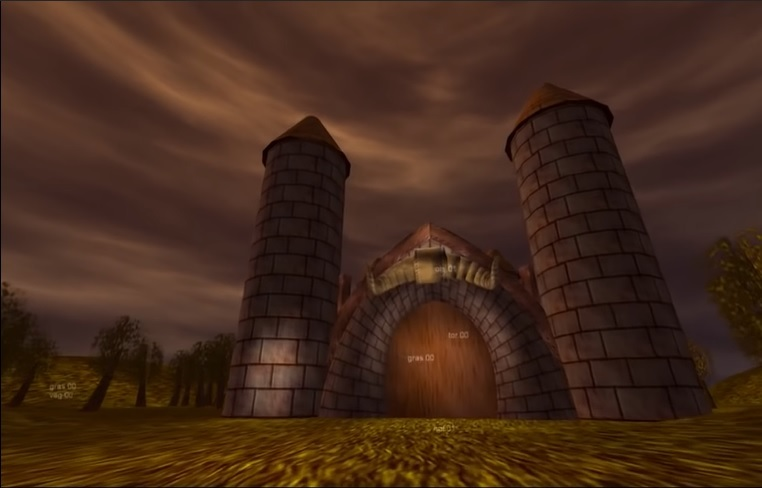
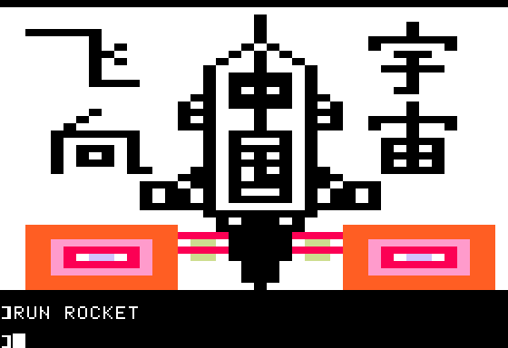
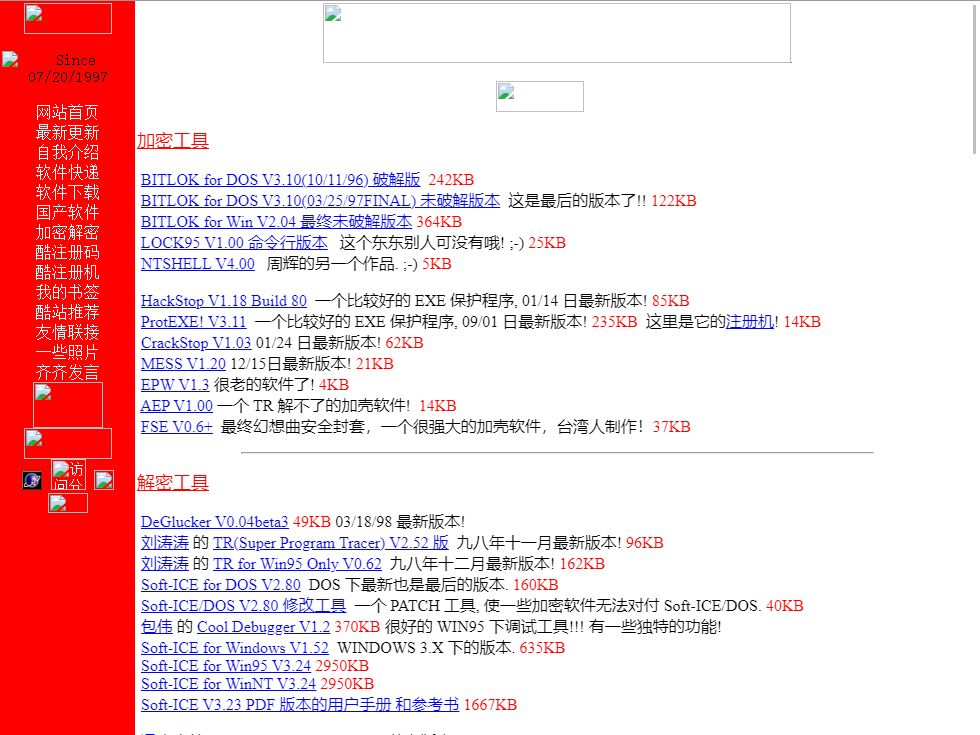
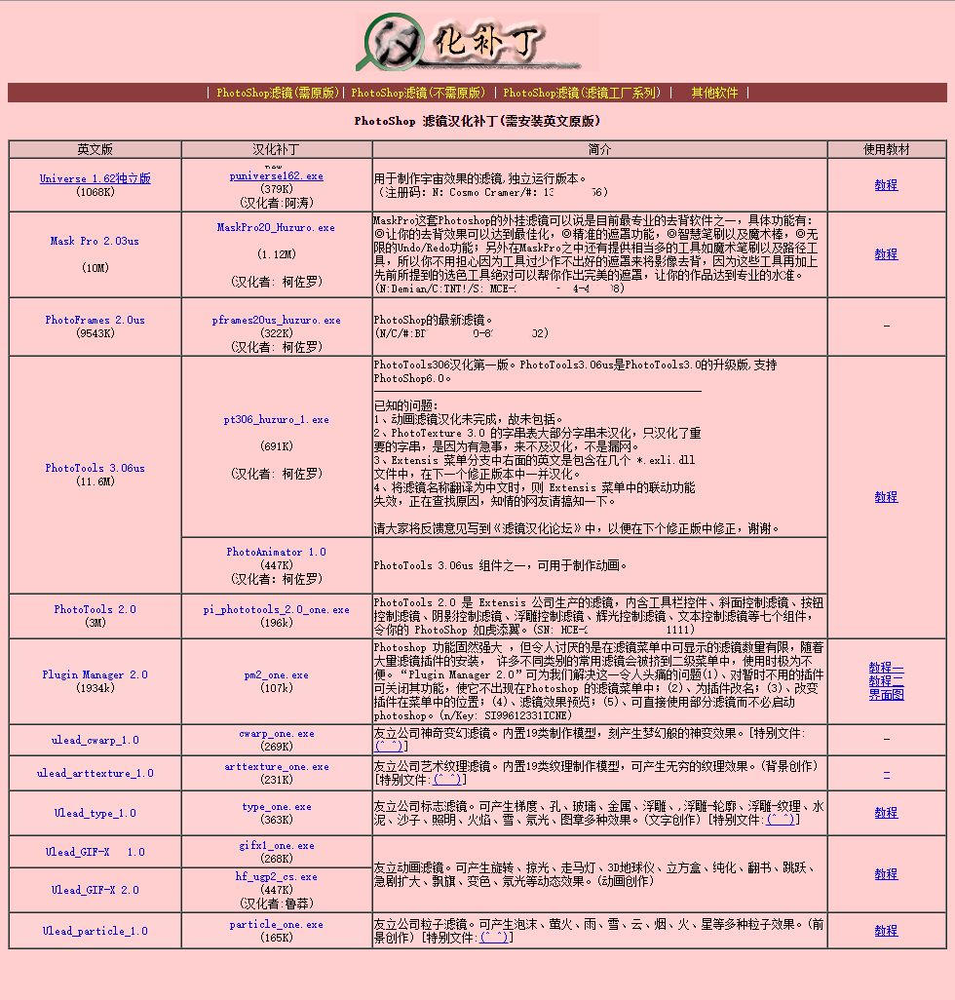
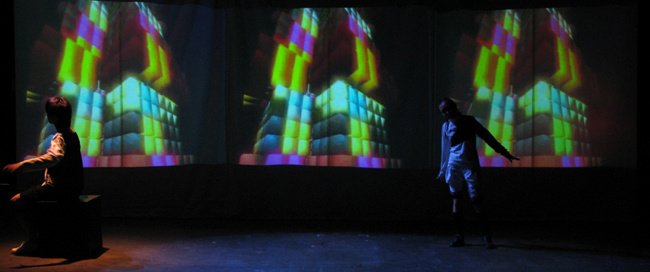
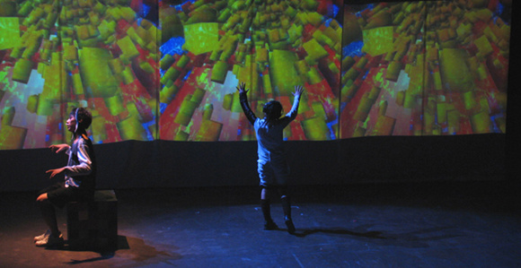
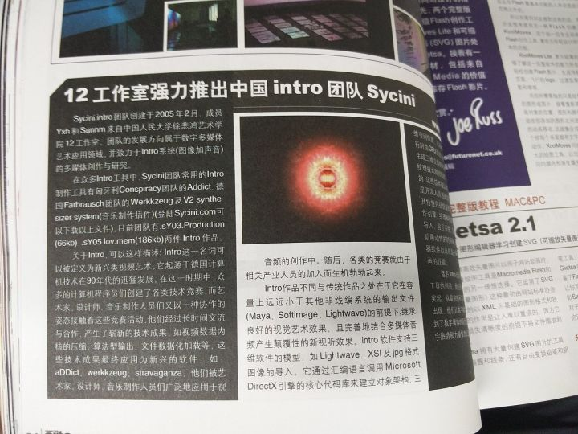
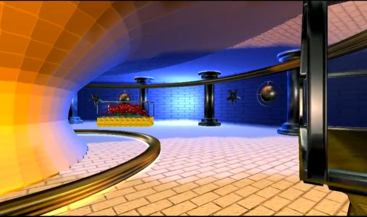

# 消失的中国演示场景
这节课是演示场景概论第十一课。前面的课程我们讲了许多欧洲的话题，这节课是时候讨论一下中国的状况了。“Demoscene在中国存在过吗？”这个问题无论是在海外还是中国都曾经被提起过，但认真回答这个问题的，或许只有我自己。

即使是今天，在这个课堂之外大多数中国人对演示场景的印象都是模糊的，许多人都听过注册机的音乐，但很少有人清楚地知道demo的制作手段，更遑论社区组织和创作动机了。

2017年，当时VICE中文网的编辑（目前子杰在经营复印info）向我约稿。我为此完成了两篇关于Demoscene的文章，即《一份关于计算机Demo的简易历史》和《8-bit 顽童的遗产：破解软件、 Demo 社区、芯片音乐和复古硬件》。

## 一问接着一问
但一个问题就一直在困扰我，中国的互联网社区跟海外的Demoscene社区是否有过联系，更进一步的，中国本土是否曾经存在过Demoscene社区？对这个问题感到好奇的显然不止有我自己，EvilRyu 的问题“sycini为什么消失了？现在国内还有demoscene group吗？”在一定程度上回答了我的问题，但他提出了的新问题同样具有挑战性。

EvilRyu的问题从2014年被提出来之后数年间都没有较为完整的回答，我的文章《昙花一现：中国Demoscene社区简史》也由此而起，我与许多当时的参与者取得了联系，比较细致地回顾了Sycini及其前后中国爱好者参与制作演示的情况，也算是给了这个多年无人解答的问题一个阶段性的答案。

但《昙花一现》一文的结尾处提到的被学院引入的Max/MSP、Processing等“创意编程”课程，是否真的就是曾经演示场景爱好者实践的继续？它们的社群之间有着怎样的联系？对我来说仍然留下了许多空白。

目前在网上公开可搜索到的较早的一系列创意编程相关的活动的记录是国内的培训机构“OF COURSE想当然”在2015年开始组织的一系列活动。

根据其中记录的一些演讲者关注的话题和他们的履历，我大概推断出2012~14年前后，国内IT行业似乎经历了一段“数据可视化”热门的时期，一些工程师在这一时期转型，之后以新媒体艺术家的身份活动，其中许多人仍然活跃在相关的场域里，其中应该没有明显的断档。

因此我研究的焦点就集中在Sycini消失的2008年到想当然的记录开始的2015年间，我希望了解这样几个事情，即Sycini消失之后，当时的参与者去向何方？中国的创意编程社群是在什么时间和场合开始出现的？主要的交流途径是什么？社区领袖都有谁？他们是否和之前的Demo作者有所重叠？我试着咨询了一些国内早期创意编程社区的组织者和参与者，算是得到了一些初步的答案。

## 中国创意编程的起点：Demo之梦
正如我在《昙花一现：中国Demoscene社区简史》所提到的，居住于重庆的叶力奥（eapass）2005年的文章《demo之梦》是国内最早一篇比较详尽的介绍演示场景的中文文章，其中提及了演示场景、磁盘杂志、演示聚会、Tracker音乐等话题。这篇文章的评论区中我们可以发现Sycini组织者sunnm（孙墨）和叶力奥的互动，留言中叶力奥婉拒了孙墨加入demoscene的邀请。

但叶力奥对中国互联网社区的影响并非仅限于一篇文章，他的个人网站“计算艺术”中分享了中国爱好者接触到的第一批Demo作品。《第七天堂》（Exceed - Heaven Seven）、《爱之记忆》（some bookprint and a broken heart - Replay）、《火域幻境》（please the cookie thing - aardbei）、《幽灵古堡》（fr-08: .the .product - Farbrausch ）等等，这批演示程序可能是迄今为止唯一一批在中国广泛传播的Demo，也是许多事先不知道演示场景的网民们所唯一能接触到的一批。

  
*许多国内爱好者都会认得“幽灵古堡”*

可以说除了叶力奥、孙墨等早期接触者，国内有大量爱好者处于“知道demo却不知道scene”的状态，一些demo作品被以“64k动画”，“黑客编程大赛”等名称传播，而传播者们却完全没有演示场景的背景知识。在国内热门的视频网站哔哩哔哩中，《幽灵古堡》被以“编程大赛”为名上传了若干次，其中有两个上传者的视频都被播放了超过一百万次。

在《demo之梦》中，叶力奥提到他的感受：“demo是团队的成果，是编程，图像，音乐的结合，而这些东西正是一个完美的计算机作品所必须的。”但无论对于当时国人对多媒体编程水平、还是当时的人们对欧洲数字文化的了解，从制作demo到组织场景活动这些概念仍然是一个朦胧的“梦”。

## 作为教育手段的电脑动画
虽然时至今日国内网民对Demo以及演示场景的概念仍然非常模糊和陌生，但2000年代的一些爱好者能够注意到Demo的存在，同时他们也感受到了Demo作为炫耀技术水平的含义，这说明国内的爱好者至少对动画制作是有一定了解的。至少在一定程度上，他们可以理解动画的复杂程度与计算机应用水平的联系。

  
*这个Apple II低分辨率图形模式下的画面，开启了中国电脑教育和动画之间的联系*

这背后的一个重要背景，是电脑动画在当时是面向青少年的计算机教育的一项重要内容。1984年开启中国计算机教育的“从娃娃做起”事件的核心，就是上海少年宫所组织的电脑动画教育活动。

一直到90年代中期，对于中国的成年人来说，能够接触到电脑动画的大概只有影视相关机构的工作人员，这从知网上几乎所有电脑动画的论文都发表在影视行业的专业期刊上就可见一斑。但青少年却有机会通过电脑教育渠道接触电脑动画软件，比如米哈游的创始人蔡浩宇就从在高校计算机课程任教的父母那里得到了接触电脑动画相关的技术的机会，而且这在当时并非个例，在1999年中国少年科学院选出的首批13位“小院士”中，包括蔡浩宇在内的四位都是因为电脑动画的特长而入选的。

我在1998~99年之间也曾经得到过一个Autodesk Animator的拷贝，而复制这个软件给我的，是我小学时的同班同学，目前他也是某高校舞美相关专业的老师。

所以说90年代城市青少年中间比较上进的一批“好孩子”是有机会能够接触到动画的软件的，如果他们不满足于用电脑打游戏，想探索一下用电脑做其他的事情而去求助他们在学校或少年宫的老师的话，基本上老师们会给他们提供两个方向，一个是信息学奥赛，另外一个方向就是电脑动画。

我的高中校友王鑫算是国内对自己的创作历程记录的比较详细的demo制作者。他在《我2005年高中时的动画梦》中提到

> 其实我是通过动画获取保送资格的，而其中的一个重要的诱因，也是因为我初三时做的一个动画，仅仅获得了市三等奖，我很不爽。最早我学习 flash，觉得其中的一些属于不太正常，不符合正常世界的常理，于是接触了济南市电子科技市场里盗版光盘里的英文 3dsMax，觉得那个符合真实的物理世界的规则定义……初中时放弃了 flash 动画，改为三维动画。
他的记录基本上复原了90年代末到2000年代初青少年接触电脑动画的途径，教育系统通过设置各类比赛、奖项和保送机会，有意识地引导青少年去接触电脑动画。但从王鑫的答辩稿中可以看出，这些以动画为主要内容的比赛主要看重作品的技术规格和主旋律的意识形态，并没有要求选手具有新媒体艺术的相关知识。

## 汉化者可能是中国最早接触到Demo的群体
那么，是什么样的途径让叶利奥他能够在2001年接触demo的呢？我相信盗版软件社群和汉化组或许都在其中起到过作用。

在1990年代，由于收入较低、跨境转账不便，国内几乎没有购买正版海外软件的渠道，而破解就成了国内电脑用户的必修课。高春辉架设的 paulgao.com.cn 是国内最早的个人网站之一，其最初的内容就是以破解软件为主的，更早些时候高春辉还是北国公司开心天地 BBS软件破解版面的版主。在1998年时，他通过网络销售一系列软件光盘，其中就包括一张《PCSoft CD'1998 tHREE - WAREZ》专集，这明确地显示出即使国内互联网社群和Warez社群之间即使没有密切联系，但至少知道其存在。

  
*高春辉的个人主页中曾经软件逆向和破解是重要的一部分内容*

另外，在国内软件传播路径中，汉化者起到了非常重要的作用。而3DS Max、Photoshop、Authorware、Flash等多媒体软件的汉化者，很可能也是国内最早一批数字媒体相关领域的开发者。叶利奥的计算艺术网站中有一个名为“滤镜汉化室”的网站，从它的名字就看出它专注于各种多媒体软件的滤镜，而几乎所有软件的汉化补丁都提供了对应的注册码或注册机。

  
*滤镜汉化室中的许多汉化插件都附送了注册码*

以当时国内的消费水平来说，几乎没有任何爱好者买得起几百美元起步的专业软件，破解和汉化几乎是一款软件能够在中国流行的必要条件，因此汉化组在中国起到了与海外志愿盗版社群（Warez）的相似的作用。注册机压缩包里偶尔出现的Demo很可能在复制与汉化的过程中也引起过他们的兴趣并得以在中国传播，一个可以与之印证的点是像CORE和Razor191这样的Warez团队在中国的知名度要远高于其他不参与破解的演示团队，CORE是 Adobe Suite和Corel Painter等多媒体制作软件的破解团队，而Razor1911则破解了半条命、星际争霸等流行的游戏。

## Demo工具的引入
farb-rausch中文同步镜像站是国内最早向国内的爱好者们介绍 演示制作工具（demotool）的网站，大概成立于2003年，其创办者是当时在成都医学院计算机教研室工作的任伟，网名叫“三伏特”。在网站的“关于”页面里，也记录了他在观看演示程序时的感受：

> 当我们看见这些动画的时候感到相当惊奇，小小的64K竟然可以包含如此精美的动画和毫无失真的音乐。出于我们的热情和爱好，我们制作了这个.farb-rausch中文同步镜像站点，希望能把这些来自德国的精美的动画以最快的时间，带给更多爱好3D动画的朋友们。
根据参与farb-rausch中文同步镜像站的信息，当时参与网站维护的成员共有三人，除了Frank可能就是任伟本人之外，剩下的两位参与者zxz和henry的身份目前还无法确定。

在Frank的主页“富兰克工作室”中提到的副站长，西南交通大学的周奇瑞（Qray，阿X）有可能就是farb-rausch中文同步镜像站提到的zxz，从他的个人主页中，可以看出中国的demo爱好者和Flash爱好者存在很大交集。周奇瑞的个人主页“Qray Studio”上展示了大量Flash制作的像素风图像，在网站的主页中提到“这些像素画都是我用鼠标一点一点画成的”，但他同样也是一名多媒体软件开发者，在“我的设计”栏目中就提供了他自己开发的WBMP编辑器和Qray字符画大师等软件。

我们看会发现，2000年代初能够较深入地研究演示程序的制作流程，并积极翻译和传播的群体许多都是大学师生，带着鲜明的学院派特点。

## Sycini：艺术学生的“探险”
2003年初，中国人民大学徐悲鸿艺术学院成立了第十二工作室，主要的创作方向是多媒体技术和艺术。在2005年初，第十二工作室部分学生就组成了Sycini团队，是目前已知的国内第一个有意识地以demo小组形式运作的团队。

Sycini团队在网站上称自己的网站为“中国Demoscene的第一个资源站”，但如果我们算上farb-rausch中文同步镜像站的建立时间，以及叶利奥“计算艺术”网站所分享的这些作品的传播范围，Sycini未必在时间上算得上“第一”。不过从对演示场景社群的理念和创作目标的来看的话，他们无疑是最早一批对演示场景的文化内涵有着较为准确理解的实践者。他们的目标不仅包括了技术上的、也包括了文化上的，即“加速实现demo、intro概念的本土化”。

  
*《6：3Ⅱ》现场*

Sycini最重要的一个特点是他们没有将制作Demo看作纯粹技术上的实践，而是非常清楚地意识到了demo的艺术和文化属性，他们积极地与传统的、学院派的新媒体艺术领域进行合作并寻求曝光机会。比如在2005年的5月，成立仅两个月的Sycini就参加了北京电影学院首届新视像新媒体艺术节，将通过与影像艺术同台展出的形式将自己与当代艺术领域对接。之后还在北京三拓旗剧社的《6：3Ⅱ》中加入了由演示程序生成的影像内容。

  
*《6：3Ⅱ》现场*

作为艺术院系背景的参与者，Sycini在有意识地通过学院背景的艺术展传播自己的作品的同时，也试图从新媒体艺术的文献中获得理论上的正当性，比如他们就介绍了艺术家Eduardo Kac的遗传艺术（genetic art），以及Christa Sommerer和Laurent Mignonneau的人工生命艺术（Artificial Life Art）等。他们自己也创作了一些学术性的文章来阐释他们对新媒体艺术的理解。

  
*《6：3Ⅱ》现场*

Sycini也是国内唯一曾被主流媒体报道的演示团队，在2005年7月曾获《Computer Arts 数码艺术》杂志的报道。他们也被写入了国内的学术期刊，《装饰》杂志2007年03期刊登了西安理工学院的陈鹏和樊荣两位老师的《从实时渲染视像demo & intro看数字视频艺术》一文，就介绍了当时国内学术界对Demoscene的一些理解，文中将Demo作品视作与综合视频作品类似的实践，并和威尼斯双年展这样的主流艺术展会中的作品做了类比。而这篇文章唯一的参考文献就是Sycini团队的网站。

  
*《Computer Arts 数码艺术》杂志对Sycini的报道*

现在看来《从实时渲染视像demo & intro看数字视频艺术》一文中有一些信息是不够准确的，比如它提到Sycini是“国内首个已参加各类Demoscene赛事的团队”。但就已有的记录来看，Sycini虽然将自己的作品通过 Pouet.net 发布，但并未参加演示比赛。但即使如此，这篇文章仍是国内学术论文中较为贴近演示场景本来面目的。之后国内的一些学者将Demoscene描述为“一些电脑高手也破解、使用游戏的代码， 重新制作介绍游戏内容的预告短片”（见《视觉文化视野中的视频游戏研究》）就显然是南辕北辙了。

## 摆脱Flash的限制
以Sycini团队为代表的艺术背景的参与者，他们选择demo工具作为他们的创作工具很大程度上只是为了摆脱Flash表现力的限制。如果我们去考察Sycini在2005年之前的一些作品，我们会发现像刘超（Lauur）的作品《北京乌托邦》等都是用Flash做的。但是从它的创作理念上，已经看出在尝试程序生成等内容了。

> 这是一个通过免费派发，或者免费网络下载的互动音乐试验。（图e,f）实验的很单纯的目的在于：一首规定了loop长度，各个音色但是没有规定小节的顺序的音乐，在作者手中和在欣赏者手中各有多少种结果？是否可以得到一个公式，比如（这里仅仅是假设）作品中loop的个数（A）乘以音色的个数（B）以小节的个数（C）次方等于一个值（X）。由此推算假如数值A，B，C中有一个是未知数或变量所造成的结果。

从2005年的sy03.production开始，孙墨（sunnm0）和叶笑寒（yxh）以Sycini的名义发布了一系列使用farb-rauch制作的64K demo，可以说是国内第一批从创作理念和方法都向国外演示场景看齐的作品。而这种尝试也确实让他们的作品呈现出完全不同于当时流行的Flash动画的视听体验。

因为我至今无法与Sycini的孙墨和叶笑寒取得联系，所以我并不能特别准确地描述这种转变发生的过程。但王鑫在一篇知乎回答（那些64k的3D动画怎么实现这么大的压缩率的？）中提到，推动他尝试制作Demo的原因是偶然接触到的Demo及其制作工具，和对当时国内三维动画的质量的不满。

> 当时是高一（2005年），通过使用 3dmax 做的动画 《勇往直前》获得保送资格后，有些厌烦其中复杂的制作流程和有损的压缩质量了，碰巧在当年的盗版光盘《3dmax 5 英文版》中，找到了一个文件夹《世界顶级动画大师制作的动画》（类似是这个名字），文件夹中有 幽灵古堡.exe(也就是最有名的 fr-08)，火域幻境.exe，爱之记忆.exe 等。
有一天，我在 fr-08 结尾彩蛋中发现了制作团队是 farbrausch，后来找到了制作工具：werkkzeug(德国，缩写 wz），然后利用 wz 制作了这个动画（心之印记，kxxt）。
> ……
> 也是因为这个，我一个高一的学生决定振兴中国的 3D 动画，因为 2005 年时的中国三维动画真的是不忍直视。( 2013 年的春晚我能指出其中的一个动画特效是直接用的 particalillustion 的特效。)因而选择了清华大学软件学院。希望能做出 NB 的动画制作软件，NB 的特效。我确实觉得，高中时在食堂围观的神六发射动画还是比较挫的。

王鑫唯一公开的作品《KXXT》的容量略大（75.5KB），并不是严格意义上的64K demo，但同样是使用farbrauch制作的。相比预渲染的动画作品，王鑫还指出了Demo作品与Flash类似的好处是能够在较小的文件尺寸和硬件资源上实现无损的高清晰度动画，在2005年时，720p以上的高清晰视频仍然需要几乎是最高配置的电脑才能处理，但许多Demo作品却可以在普通配置下以1024x768分辨率下流畅运行。

  
*KXXT*

相比Sycini有着更明确的对作品从实验艺术角度出发的解释，中学时代的王鑫的创作动机是校园恋情，虽然与海外创作者竞争的、炫耀性的创作不尽相同，但这种出于社交需要的创作动机显示出国内外青少数字内容创作者的共性。

《KXXT》的内容也透露出中文流行音乐的影响。大多数情况下，Demoscene的创作者倾向使用原创音乐，而非流行歌曲的翻录版本。但《KXXT》中我们可以清晰地辨认出光良的歌曲《童话》的主旋律。

## 专注于程序尺寸的开发者们
如果说Sycini团队和王鑫这样使用demo工具的创作者的创作目标更多是为了摆脱Flash动画表现力的限制，并探索更丰富的屏幕表达形式，程序员背景的参与者们花了更多心思来研究size-coding的技巧。

比如说另外一个非常早接触 demo的爱好者，也是之后进入机器人领域创业的陈世凯，就创作了国内互联网上最早的demo教程之一。他2006年的模块音乐（Mod）教程很可能是国内首个Tracker音乐制作教程。

在Sycini社群接近落幕的2008年，陈世凯整理和总结了怎样缩小Visual C程序容量的一些技巧。但是就目前的资料看来，陈世凯并没有独立发表过Demo作品。

我们会发现国内Demo制作活动的参与者里面，有似乎有一种分野：一些人希望能够做内容丰富的，具有视觉冲击力的演示程序，而另外一批人则执着于把程序做得更小。比如说dwing在当时也是国内活跃的demo作者之一，但他更重要的作品是可执行文件加壳软件UPack/WinUPack，和Warez社群的联系更加紧密。dwing的demo作品更侧重硬编码的size-coding，但图像效果较少，按今天的标准仅能算作单一效果演示（one effect demo）。

现在看来，当时的demo制作者内部依照他们制作demo的动机实际上分为了两派：演示场景是一个更技术还是更艺术的事情，他们从来没有达成一致。

## 新潮流的到来和自我反省的缺失
我们在这个系列的第五课就曾经提到过，演示场景能够穿越技术变革和文化潮流的周期而成为历史最为悠久的数字文化社群的一个重要因素是其自我反省（self-reflective）的特点，即使演示场景的参与者往往是技术高手，但他们对技术潮流仍保持一种谨慎的态度。（Demoscene Platforms: A Case Study on the Adoption of Home Computers）

许多文章在描述欧洲的演示社群时，都用了“自我意识”（self-awareness）、“自我反省”（self-reflection）、自我满足（self sufficient）这样的词汇。国内的社群中虽然出现了Sycini这样的社群中心，但只能算聚集了不同兴趣和背景的爱好者的信息广场，并没有形成一个有自我意识和自我反思性质的社群。

而在Sycini出现不久，国内开始密集地引介海外学术和商业界的新媒体创作手段及艺术家。比如2006北京新媒体艺术展、2007北京大声展中，都有不少艺术家展示了MAX/MSP创作的内容。同一时期，国内学院派及商业化的新媒体艺术相关的技术社群也开始出现，除了少数独立论坛之外，这些爱好者的主要聚集地为豆瓣。

2006年的 interactive-china.net 上线，2007年豆瓣上则出现了“processing学习组”和Arduino小组，2008豆瓣上还出现了VVVV、Max/Msp/Jitter、OpenFrameworks & Cider等小组，他们最早的工作其实和farb-rausch中文同步镜像站类似，都是翻译海外的文档和教材。

相比演示场景，新媒体艺术领域的评价标准显然更少限制，同时也更加结果导向。演示场景中“炫技”的部分，比如size-coding追求的极小的程序容量被认为是缺少意义的，而学院派的新媒体制作工具上手门槛更低，文档更齐全，同时也不像演示场景那样与反商业的黑客意识形态绑定，也更容易被传统的当代艺术从业者和商业客户所理解。

在这一时期，本身就对技术感兴趣的参与者，比如王鑫、陈世凯以及更晚些参与的cjxgm等多数选择了进入IT行业工作，而远离了缺少实用价值的demo制作活动。曾在Sycini运作的过程中扮演组织者角色的艺术背景的学生则几乎毫无迟疑地转向学院派的制作工具，并没有体现出演示场景在面对工具时的审慎和怀疑。有时技术背景的参与者也会被当代艺术场域的实践“收编”，如陈世凯在2008年参加上海电子艺术节时，就出于开发周期的考量采用了Processing。虽然这种“收编”并非完全顺畅的，陈世凯在其参展感受中就提及他对Processing“颇有微词”，但他同样提到作为业余创作者在平衡日常工作和创作时的压力“不过因为在8月我已经正式工作了，可用时间比料想的少很多”。

陈世凯向我们展示了一个生动的例子，显示出学院派新媒体制作工具从demo工具或其他demoscene风格的实践手中抢走了它们的潜在参与者，这有些像我们在第九节课所提到的日本的情景：繁荣的动漫行业在爱好者们接触演示场景之前就已经制定了庞杂的创作规则，这让日本的创作者无论选择游戏还是非实时的动画都可以更加轻松地进入到已有的规则里，而实时运行却没有互动性的演示程序，则被排除在动漫行业打造的生态系统之外。

在中国，实时且非互动的新媒体艺术作品，最好的发布途径恰恰是学院派的传统的新媒体艺术展。这些展览对作品的期望与演示程序有一定的重叠，比如它们都重视视觉效果的呈现，但演示场景中那些无法被视觉呈现的技术要素，如引擎的原创性和程序的尺寸则被忽略了。这种评价标准实际上鼓励了创作者放弃编写程序的底层部分，而专注于通过已有的引擎实现更复杂的视觉效果。

## 2010年后：新媒体艺术的繁荣和演示场景的缺位
2009年真锅大度在北京的公开表演显示了新媒体艺术的公共性。2010年新车间在上海成立，让新媒体艺术被受到“山寨”文化影响的创客社群所了解。此时，实时渲染的计算机图像作品在中国实现了本土化的落地，但却并未如Sycini创立时的愿景那样是演示场景的本土化，中国的新媒体艺术社群也从未带上演示场景所具有的反商业化精神和竞赛气氛。

不过，即使这一时期的新媒体艺术爱好者许多都进入了工商业界。但其实践亦不完全是功利的。曾经与陈世凯参加同场上海电子艺术节的罗霄“Contra”和张静“Vinjn”，就曾长期运营hudo.it论坛，亦组织过多场新媒体艺术工作坊和聚会。同时OpenBook开源杂志也曾经刊文介绍过VVVV等新媒体制作工具。

但是这种不属于Demoscene的学院派的新媒体艺术越繁荣，或许中国出现能够与世界交流的本土演示场景的希望就越渺茫，甚至包括我自己都处在一个被“招安”的地位上。

演示场景的繁荣至少需要有几个条件，即全社会较高的美育水平、较高的计算机普及率、较好的社会福利水平和较不繁荣的投资氛围。在学院和商业化的新媒体艺术繁荣的美国，同样没有繁荣的演示场景。繁荣的投资让掌握新媒体相关技能的人群由于雇佣状况的不同而产生极大的贫富差异，并进而推动人们进入工业界赚取薪水而非参与利他主义的、非功利的场景。

## 仅存的中国Scener
但中国真的就没有Scener了吗？我认为现在的中国处于一个有Scener但没有Scene的阶段，首先，一部分跨国企业外派中国的工程师可能有演示场景的背景，并将相应的知识介绍给国内的爱好者，其中的一个案例就是中国唯一仍在持续参加海外比赛的参与者EvilRyu，他是在ARM任职GPU工程师的时候从挪威Ephidrena小组的成员Loaderror那里接触到演示场景的。

除了EvilRyu，近年来能够在演示场景中找到的中国面孔还有在武汉工作的台湾工程师TsanChungHsu，他将自己制作的一系列中文流行歌曲的MOD文件上传至ModArchive。

我曾经在2018年的文章中寄希望于创意编程在学院课程中的发展会促进更多人接触演示场景，但在四年之后的今天我更加悲观：新媒体艺术的商业化发展进一步挤压了非商业化的场景的发展空间，围绕人工智能和数字货币的创意内容的金融化炒作正在将更多创作者卷入逐利的浪潮中。

目前我不认为中国在可预见的未来会出现一个独立的、具有自我意识和自我反省的演示场景，但借鉴Demoscene的一些做法或许是可行的，就像我上一节课提到的演示聚会、比赛和现场演出，都可以成为文化旅游和文化产业的一部分而在中国找到其发展的空间。同时演示场景作为数个国家的非物质文化遗产，或许可以在国际文化交流的过程中得到政府和学院的认可。这会有一点像其他起源于草根的文化社群被士绅化的过程，就像滑板和涂鸦所经历的那样。